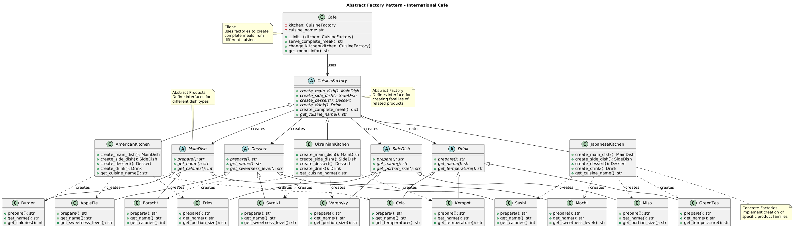

# Abstract Factory Pattern

An implementation of the Abstract Factory design pattern using an international cafe specializing in different national cuisines.

## Problem and Solution

### The Problem
When building applications that need to support multiple product families or variants, you often face these challenges:

- **Tight Coupling**: Creating objects directly with `new` operators makes your code dependent on specific concrete classes
- **Inconsistent Product Families**: Nothing prevents mixing products from different families (e.g., serving Japanese sushi with American fries)
- **Difficult Extension**: Adding new product families requires modifying existing client code throughout the application
- **Inflexible Configuration**: Switching between product families at runtime becomes complex and error-prone

For example, imagine a restaurant application that needs to serve different national cuisines. Without proper abstraction, you might end up with code like:
```python
if cuisine_type == "japanese":
    main = Sushi()
    side = MisoSoup()
    # Risk: accidentally mixing with AmericanFries()
elif cuisine_type == "american":
    main = Burger()
    side = Fries()
    # Adding new cuisine requires modifying this code
```

### The Solution
The Abstract Factory pattern solves these problems by:

1. **Defining Abstract Product Interfaces**: Each product type (MainDish, SideDish, etc.) has a clear contract
2. **Creating Product Families**: Each concrete factory produces a complete, consistent family of related products
3. **Encapsulating Object Creation**: Clients depend only on abstract interfaces, not concrete implementations
4. **Enabling Easy Extension**: New product families can be added without changing existing code

In our cafe example:
```python
# Client code remains the same regardless of cuisine
cafe = Cafe(kitchen_factory)  # kitchen_factory can be any cuisine
meal = cafe.serve_complete_meal()  # Always gets consistent family
```

## Pattern Overview

The Abstract Factory pattern provides an interface for creating families of related or dependent objects without specifying their concrete classes. In this implementation:

- **Abstract Products**: Different types of dishes (MainDish, SideDish, Dessert, Drink)
- **Concrete Products**: Specific dishes for each cuisine (Japanese, American, Ukrainian)
- **Abstract Factory**: CuisineFactory interface for creating complete meals
- **Concrete Factories**: Kitchen classes that create cuisine-specific dish families

## Structure

```
abstract_factory/
├── __init__.py              ← Public API
├── __main__.py              ← Demo script
├── cafe.py                  ← Client class
├── dishes/                  ← Abstract product classes
│   ├── __init__.py
│   └── base.py              ← MainDish, SideDish, Dessert, Drink
├── factories/               ← Factory classes
│   ├── __init__.py
│   ├── base.py              ← CuisineFactory (abstract)
│   ├── japanese.py          ← JapaneseKitchen
│   ├── american.py          ← AmericanKitchen
│   └── ukrainian.py         ← UkrainianKitchen
└── kitchens/               ← Concrete product implementations
    ├── __init__.py
    ├── japanese_dishes.py   ← Sushi, Miso, Mochi, GreenTea
    ├── american_dishes.py   ← Burger, Fries, ApplePie, Cola
    └── ukrainian_dishes.py  ← Borscht, Varenyky, Syrniki, Kompot
```

## Usage

### As a module:
```python
from abstract_factory import Cafe, JapaneseKitchen

# Create cafe with Japanese cuisine
cafe = Cafe(JapaneseKitchen())
meal = cafe.serve_complete_meal()
print(meal)

# Switch to different cuisine
from abstract_factory import AmericanKitchen
cafe.change_kitchen(AmericanKitchen())
```

### Run the demo:
```bash
python -m abstract_factory
```

## Key Components

1. **Abstract Products** (Dish classes): Define interfaces for each type of dish
2. **Concrete Products** (Specific dishes): Implement dishes for each national cuisine
3. **Abstract Factory** (`CuisineFactory`): Defines methods for creating complete meal families
4. **Concrete Factories** (Kitchen classes): Create cuisine-specific product families
5. **Client** (`Cafe`): Uses factories to serve complete meals from different cuisines

## Supported Cuisines

### 🍱 Japanese Kitchen
- Main: Assorted Sushi Platter
- Side: Miso Soup
- Dessert: Red Bean Mochi
- Drink: Matcha Green Tea

### 🍔 American Kitchen
- Main: Classic Cheeseburger
- Side: French Fries
- Dessert: Apple Pie
- Drink: Classic Cola

### 🍲 Ukrainian Kitchen
- Main: Traditional Borscht
- Side: Potato Varenyky
- Dessert: Syrniki with Sour Cream
- Drink: Mixed Fruit Kompot

## Benefits

- **Product Family Consistency**: All dishes from one kitchen work together harmoniously
- **Easy Extension**: Add new cuisines without modifying existing code
- **Interchangeable Families**: Switch between complete cuisine sets seamlessly
- **Encapsulation**: Client works with abstract interfaces, not concrete implementations

## Diagram
