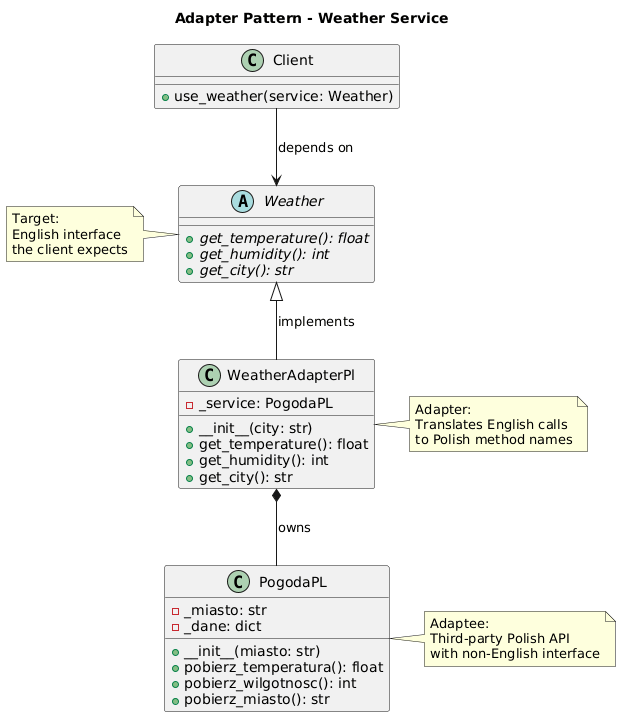

# Adapter Pattern

An implementation of the Adapter design pattern that wraps a Polish-language weather service (`PogodaPL`) behind a clean English interface (`Weather`).

## Problem and Solution

### The Problem
When integrating third-party or legacy code, you often face an incompatible interface:

- **Name Mismatch**: The external class has method names in another language or convention that your codebase does not expect
- **Tight Coupling**: Calling Polish method names directly throughout client code makes it unreadable and hard to replace
- **No Shared Contract**: The third-party class does not implement your target interface, so it cannot be passed where a `Weather` is expected

For example, without the adapter:
```python
# Client forced to know the Polish API details
service = PogodaPL("warsaw")
temp = service.pobierz_temperatura()   # what does this mean?
hum  = service.pobierz_wilgotnosc()    # hard to read, hard to swap
```

### The Solution
The Adapter pattern solves this by introducing a wrapper class that:

1. **Implements the target interface** (`Weather`) so it can be used anywhere a `Weather` is expected
2. **Translates calls** from the English interface to the Polish method names internally
3. **Hides the adaptee** — the client never knows `PogodaPL` exists

```python
# Client only knows the English interface
service: Weather = WeatherAdapterPl("warsaw")
temp = service.get_temperature()   # clean, readable, swappable
hum  = service.get_humidity()
```

## Pattern Overview

The Adapter pattern converts the interface of a class into another interface that clients expect. It lets classes work together that otherwise could not because of incompatible interfaces.

- **Target** (`Weather`): The interface the client depends on
- **Adaptee** (`PogodaPL`): The existing class with an incompatible interface
- **Adapter** (`WeatherAdapterPl`): Wraps the adaptee and implements the target interface
- **Client** (`__main__`): Uses only the `Weather` interface, unaware of `PogodaPL`

## Structure

```
adapter/
├── __init__.py              ← Public API
├── __main__.py              ← Demo script
├── weather.py               ← Target interface (Weather ABC)
├── pogoda_pl.py             ← Adaptee (Polish weather service)
├── weather_adapter_Pl.py    ← Adapter (WeatherAdapterPl)
├── adapter_uml.puml         ← Structural + sequence UML diagrams
└── tests/
    └── test_weather_adapter.py
```

## Usage

### As a module:
```python
from adapter import WeatherAdapterPl, Weather

service: Weather = WeatherAdapterPl("warsaw")
print(service.get_temperature())   # 21.5
print(service.get_humidity())      # 73
print(service.get_city())          # warsaw
```

### Run the demo:
```bash
python -m adapter
```

### Run the tests:
```bash
python -m pytest adapter/tests/
# or
python -m unittest discover adapter/tests/
```

## Key Components

### Target — `Weather` (weather.py)
Abstract base class defining the English interface the client depends on:
- `get_temperature() -> float`
- `get_humidity() -> int`
- `get_city() -> str`

### Adaptee — `PogodaPL` (pogoda_pl.py)
Third-party Polish weather service with incompatible method names:
- `pobierz_temperatura()` — returns temperature in Celsius
- `pobierz_wilgotnosc()` — returns humidity percentage
- `pobierz_miasto()` — returns city name

### Adapter — `WeatherAdapterPl` (weather_adapter_Pl.py)
Implements `Weather` and delegates each call to the corresponding Polish method on `PogodaPL`.

| English (Target)    | Polish (Adaptee)         |
|---------------------|--------------------------|
| `get_temperature()` | `pobierz_temperatura()`  |
| `get_humidity()`    | `pobierz_wilgotnosc()`   |
| `get_city()`        | `pobierz_miasto()`       |

## Benefits

- **Open/Closed**: Client code never changes when the underlying service is replaced
- **Single Responsibility**: Translation logic lives in one place — the adapter
- **Reusability**: `PogodaPL` can be reused without modification
- **Testability**: The `Weather` interface can be mocked independently of `PogodaPL`

## Diagrams

- **`adapter_schema.puml`** — structural class diagram: Target, Adapter, Adaptee relationships

- **`adapter_flow.puml`** — sequence diagram: call flow from Client through Adapter to PogodaPL
