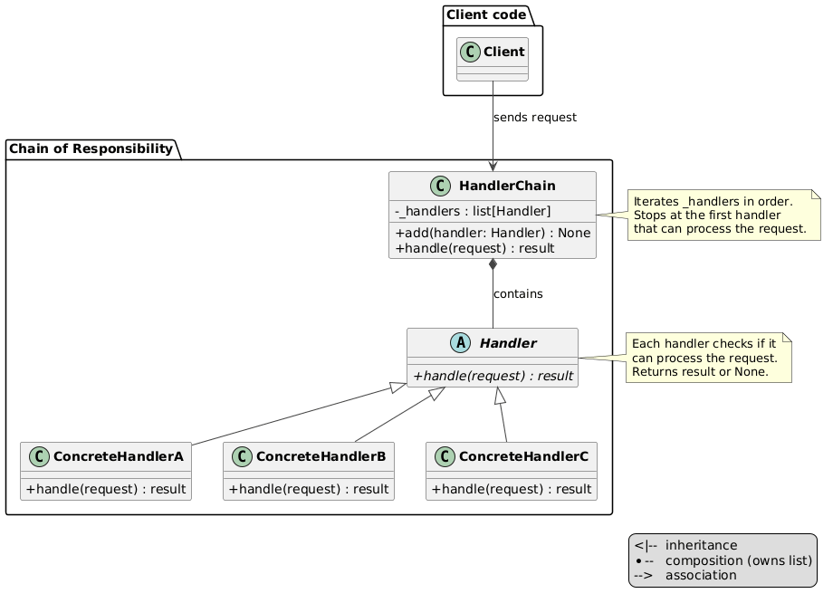
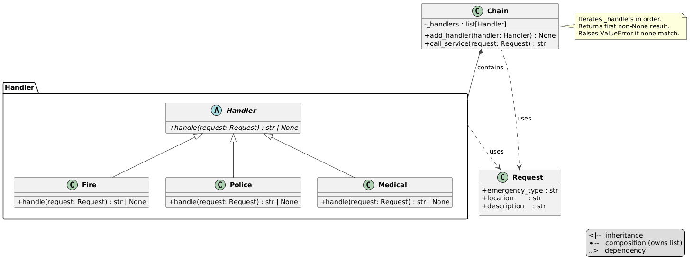

# Chain of Responsibility Pattern

An implementation of the Chain of Responsibility design pattern for an emergency dispatcher — a single interface routes requests to the correct service (Fire, Police, Medical).


## Problem and Solution

### The Problem
Without the pattern, the client must know about every service and decide which one to call:

```python
# Without Chain of Responsibility — client handles routing logic:
if request.type == "fire":
    fire_dept.dispatch(request)
elif request.type == "police":
    police.dispatch(request)
elif request.type == "medical":
    ambulance.dispatch(request)
```

Every new service type forces a change in the client.

### The Solution
A `Chain` holds a list of handlers and iterates them. Each handler decides independently if it can process the request. The client calls one method:

```python
chain = Chain([Fire(), Police(), Medical()])
chain.call_service(Request("fire",    "Main St",  "Building on fire"))  # → Fire dept dispatched
chain.call_service(Request("police",  "Broadway", "Robbery"))           # → Police dispatched
chain.call_service(Request("medical", "Park Ave", "Heart attack"))      # → Medical dispatched
```

## Pattern Overview

- **Request** (`request.py`): data object — `emergency_type`, `location`, `description`
- **Handler** (`handler.py`): ABC — one abstract method `handle(request) → str | None`
- **Fire / Police / Medical** (`handlers/`): concrete handlers — return a response string if the type matches, `None` otherwise
- **Chain** (`chain.py`): holds `_handlers: list[Handler]`, iterates them, returns the first non-`None` result, raises `ValueError` if none match

## Structure

```
behavioral/chain-of-responsibility/
├── __init__.py
├── __main__.py              ← demo
├── module_schema.txt
├── request.py               ← Request (dataclass)
├── handler.py               ← Handler ABC
├── chain.py                 ← Chain
├── handlers/
│   ├── __init__.py
│   ├── fire.py              ← Fire
│   ├── police.py            ← Police
│   └── medical.py           ← Medical
├── uml/
│   ├── cor_general.puml     ← abstract pattern diagram
│   ├── cor_schema.puml      ← structural class diagram
│   └── cor_flow.puml        ← sequence diagram
└── tests/
    └── test_cor.py
```

## Usage

### As a module:
```python
from behavioral.chain-of-responsibility import Chain, Request
from behavioral.chain-of-responsibility.handlers import Fire, Police, Medical

chain = Chain([Fire(), Police(), Medical()])
print(chain.call_service(Request("medical", "Park Ave", "Heart attack")))
```

### Run the demo:
```bash
python -m behavioral.chain_of_responsibility
```

### Run the tests:
```bash
python -m unittest behavioral.chain_of_responsibility.tests.test_cor -v
```

## Key Components

### Handler (`handler.py`)
Single abstract method:
```python
def handle(self, request: Request) -> str | None: ...
```
Returns a string if handled, `None` to pass along. Handlers are completely independent — they know nothing about each other or the chain.

### Chain (`chain.py`)
Owns the iteration logic. Handlers have no `_next` reference — the chain controls the flow:
```python
def call_service(self, request: Request) -> str:
    for handler in self._handlers:
        response = handler.handle(request)
        if response is not None:
            return response
    raise ValueError(f"No handler found for emergency type: '{request.emergency_type}'")
```

### Adding handlers at runtime:
```python
chain = Chain([Fire()])
chain.add_handler(Police())   # extend the chain dynamically
chain.add_handler(Medical())
```

## Call Flow

```
chain.call_service(Request("medical", "Park Ave", "Heart attack"))
  → Fire.handle()    → None    (type != "fire",   skip)
  → Police.handle()  → None    (type != "police", skip)
  → Medical.handle() → "Medical ASSISTANCE dispatched to Park Ave..."
  ← return result
```

## Diagrams

- **`uml/cor_schema.puml`** — structural class diagram with Request, Handler, Chain and all relationships
-
- **`uml/cor_flow.puml`** — sequence diagram: fire dispatch, medical chain iteration, unknown type error

## Benefits

- **Open/Closed**: add a new service by creating a new `Handler` subclass and adding it to the chain — no existing code changes
- **Decoupled handlers**: each handler only knows its own type — Fire knows nothing about Police or Medical
- **Flexible ordering**: chain order is set at wiring time, not hardcoded in handlers
- **Single entry point**: client calls `call_service()` regardless of which service is needed
