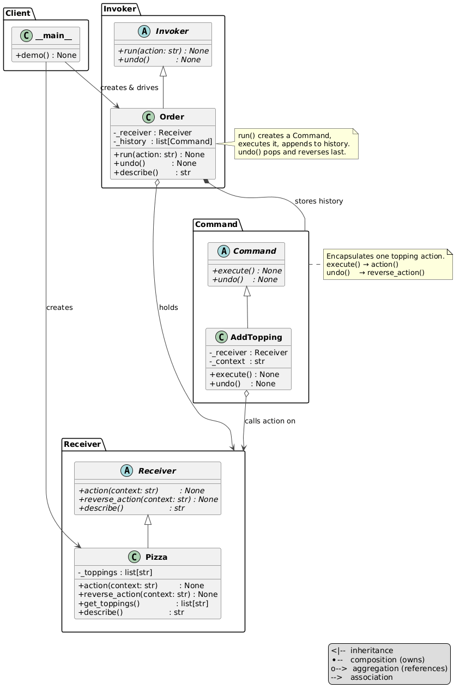

# Command Pattern

An implementation of the Command design pattern for building a custom pizza order — each topping addition is a reversible command object.


## Problem and Solution

### The Problem
Without the pattern, adding a topping and undoing it means the client holds all the state and logic directly:

```python
# Without Command — no history, no undo:
toppings = []
toppings.append("cheese")
toppings.append("bacon")
toppings.remove("bacon")   # client must track what to remove manually
```

There is no history, no encapsulation of the action, and no clean way to undo arbitrary steps.

### The Solution
Each topping addition becomes a `Command` object that knows both how to apply and reverse itself. An `Order` (invoker) stores the history and delegates undo to the last command:

```python
order = Order(Pizza())
order.run("cheese")
order.run("bacon")
order.describe()   # → "Base Pizza, cheese, bacon"

order.undo()
order.describe()   # → "Base Pizza, cheese"
```

## Pattern Overview

- **Receiver** (`receiver.py`): ABC — `action`, `reverse_action`, `describe`
- **Pizza** (`pizza.py`): concrete receiver — manages `_toppings` list
- **Command** (`command.py`): ABC — `execute`, `undo`
- **AddTopping** (`commands/add_topping.py`): concrete command — calls `action` / `reverse_action` on the receiver
- **Invoker** (`invoker.py`): ABC — `run`, `undo`
- **Order** (`order.py`): concrete invoker — creates commands, executes them, maintains `_history`

## Structure

```
behavioral/command/
├── __init__.py
├── __main__.py              ← demo
├── module_schema.txt
├── command.py               ← Command ABC
├── receiver.py              ← Receiver ABC
├── invoker.py               ← Invoker ABC
├── pizza.py                 ← Pizza (receiver)
├── order.py                 ← Order (invoker)
├── commands/
│   ├── __init__.py
│   └── add_topping.py       ← AddTopping command
├── uml/
│   ├── command_general.puml ← abstract pattern diagram
│   ├── command_schema.puml  ← structural class diagram
│   └── command_flow.puml    ← sequence diagram
└── tests/
    ├── __init__.py
    └── test_command.py
```

## Usage

### As a module:
```python
from behavioral.command.pizza import Pizza
from behavioral.command.order import Order

order = Order(Pizza())
order.run("cheese")
order.run("bacon")
order.run("pineapple")
print(order.describe())   # Base Pizza, cheese, bacon, pineapple

order.undo()
print(order.describe())   # Base Pizza, cheese, bacon
```

### Run the demo:
```bash
python -m behavioral.command
```

### Run the tests:
```bash
python -m pytest behavioral/command/tests/
```

## UML Diagrams

### Structural diagram



### Sequence diagram


## Difference from Related Patterns

| Pattern   | Intent |
|-----------|--------|
| **Command**  | Encapsulates a request as an object with full undo support via stored history |
| **Strategy** | Encapsulates an algorithm — swappable at runtime, no history or undo |
| **Observer** | Notifies dependents of state changes — no encapsulated action, no undo |
