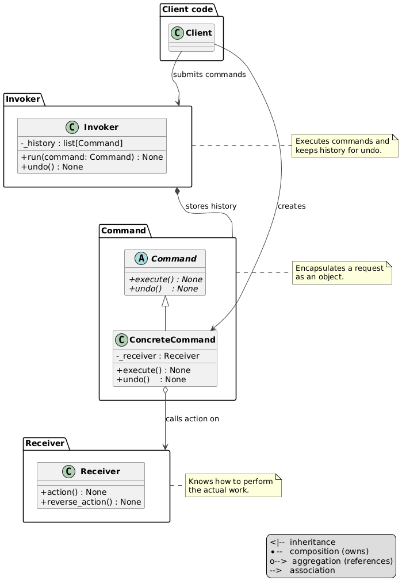

# Command Pattern

An implementation of the Command design pattern for building a custom pizza order — each operation is a reversible command object created by the client and passed to the invoker.



## Problem and Solution

### The Problem
Without the pattern, the client holds all state and logic directly — there is no history and no clean way to undo arbitrary steps:

```python
toppings = []
toppings.append("cheese")
toppings.append("bacon")
toppings.remove("bacon")   # client must track what to remove manually
```

### The Solution
Each operation becomes a `Command` object the client creates explicitly. An `Order` (invoker) executes it and stores it in history. Undo delegates back to the command:

```python
from behavioral.command.pizza import Pizza
from behavioral.command.order import Order
from behavioral.command.commands import AddTopping, RemoveTopping, ClearTopping

pizza = Pizza()
order = Order(pizza)

order.run(AddTopping(pizza, "cheese"))
order.run(AddTopping(pizza, "bacon"))
order.describe()   # → "Base Pizza, cheese, bacon"

order.run(RemoveTopping(pizza, "bacon"))
order.describe()   # → "Base Pizza, cheese"

order.undo()
order.describe()   # → "Base Pizza, cheese, bacon"

order.run(ClearTopping(pizza))
order.describe()   # → "Base Pizza (no toppings)"

order.undo()
order.describe()   # → "Base Pizza, cheese, bacon"
```

## Pattern Overview

- **Receiver** (`receiver.py`): ABC — `action`, `reverse_action`, `clear_actions`, `get_actions`, `describe`
- **Pizza** (`pizza.py`): concrete receiver — manages `_toppings` list
- **Command** (`command.py`): ABC — `execute`, `undo`
- **AddTopping** (`commands/add_topping.py`): adds one topping; undo removes it
- **RemoveTopping** (`commands/remove_topping.py`): removes one topping; undo adds it back
- **ClearTopping** (`commands/clear_topping.py`): clears all toppings; undo restores from snapshot
- **ItalianCustomToppings** (`commands/italian_custom_toppings.py`): batch-adds Mozzarella, Olives, Tomatoes; undo removes all three
- **Invoker** (`invoker.py`): ABC — `run(cmd)`, `undo`
- **Order** (`order.py`): concrete invoker — executes commands, maintains `_history`

## Structure

```
behavioral/command/
├── __init__.py
├── __main__.py              ← demo
├── module_schema.txt
├── command.py               ← Command ABC
├── receiver.py              ← Receiver ABC
├── invoker.py               ← Invoker ABC
├── pizza.py                 ← Pizza (receiver)
├── order.py                 ← Order (invoker)
├── commands/
│   ├── __init__.py
│   ├── add_topping.py           ← AddTopping
│   ├── remove_topping.py        ← RemoveTopping
│   ├── clear_topping.py         ← ClearTopping (snapshot-based undo)
│   └── italian_custom_toppings.py ← ItalianCustomToppings (batch)
├── uml/
│   ├── command_general.puml ← abstract pattern diagram
│   ├── command_schema.puml  ← structural class diagram
│   └── command_flow.puml    ← sequence diagram
└── tests/
    ├── __init__.py
    └── test_command.py
```

## Usage

### Run the demo:
```bash
python -m behavioral.command
```

### Run the tests:
```bash
python -m unittest behavioral.command.tests.test_command
```

## UML Diagrams

### Structural diagram


### Sequence diagram
See `uml/command_flow.puml`

## Difference from Related Patterns

| Pattern      | Intent |
|--------------|--------|
| **Command**  | Encapsulates a request as an object; client creates and passes commands to invoker; full undo via history |
| **Strategy** | Encapsulates an algorithm — swappable at runtime, no history or undo |
| **Observer** | Notifies dependents of state changes — no encapsulated action, no undo |
