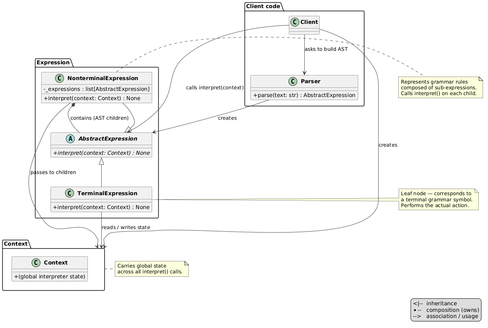
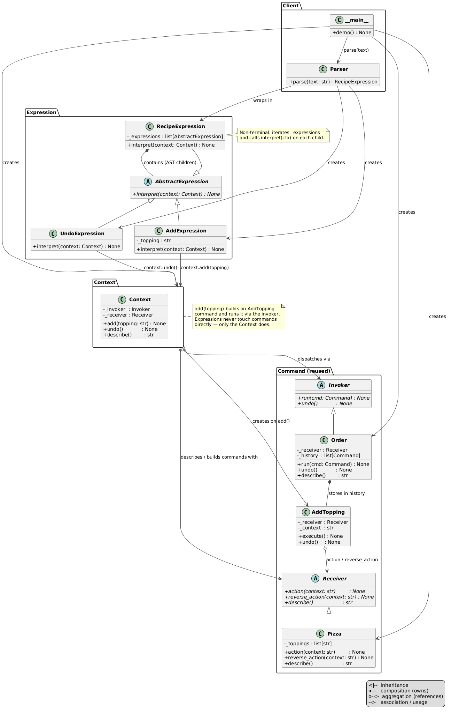

# Interpreter Pattern

An implementation of the Interpreter design pattern for executing a custom pizza recipe string — a grammar is defined, a parser builds an AST of expression objects, and each expression interprets itself against a shared `Context`.



## Problem and Solution

### The Problem
Without the pattern, parsing and executing a recipe string requires a monolithic block of conditionals with no composability — adding a new instruction means editing the same loop:

```python
recipe = "add:cheese, add:bacon, undo, add:mushroom"
toppings = []
history = []

for token in recipe.split(", "):
    if token.startswith("add:"):
        t = token[4:]
        toppings.append(t)
        history.append(t)
    elif token == "undo" and history:
        toppings.remove(history.pop())
```

### The Solution
Each grammar rule becomes an expression class. A parser builds a tree; calling `interpret(ctx)` on the root walks the tree and executes:

```python
from behavioral.interpreter.context import Context
from behavioral.interpreter.parser import parse
from behavioral.command.pizza import Pizza
from behavioral.command.order import Order

pizza = Pizza()
ctx = Context(Order(pizza), pizza)

recipe = parse("add:cheese, add:bacon, undo, add:mushroom")
recipe.interpret(ctx)

ctx.describe()   # → "Base Pizza, cheese, mushroom"
```

## Pattern Overview

- **AbstractExpression** (`expression.py`): ABC — single abstract method `interpret(context: Context)`
- **AddExpression** (`expressions/add_expression.py`): terminal — calls `context.add(topping)`
- **UndoExpression** (`expressions/undo_expression.py`): terminal — calls `context.undo()`
- **RecipeExpression** (`expressions/recipe_expression.py`): non-terminal — iterates child expressions and calls `interpret(ctx)` on each
- **Context** (`context.py`): holds the injected `Invoker` (Order) and `Receiver` (Pizza); exposes `add()`, `undo()`, `describe()` — expressions never build or run commands directly
- **Parser** (`parser.py`): splits the input string by `,` and maps tokens to expression objects; raises `ValueError` on unknown tokens

## Structure

```
behavioral/interpreter/
├── __init__.py
├── __main__.py              ← demo
├── module_schema.txt
├── expression.py            ← AbstractExpression ABC
├── context.py               ← Context (DI: Invoker + Receiver)
├── parser.py                ← string → RecipeExpression AST
├── expressions/
│   ├── __init__.py
│   ├── add_expression.py    ← TerminalExpression for add:<topping>
│   ├── undo_expression.py   ← TerminalExpression for undo
│   └── recipe_expression.py ← NonterminalExpression (sequence)
├── uml/
│   ├── interpreter_general.puml ← abstract pattern diagram
│   ├── interpreter_schema.puml  ← concrete class diagram
│   └── interpreter_flow.puml    ← sequence diagram
└── tests/
    ├── __init__.py
    └── test_interpreter.py
```

## Usage

### Run the demo:
```bash
python -m behavioral.interpreter
```

### Run the tests:
```bash
python -m unittest behavioral.interpreter.tests.test_interpreter -v
```

## UML Diagrams

### Structural diagram
See `uml/interpreter_schema.puml`


### Sequence diagram
See `uml/interpreter_flow.puml`

## Difference from Related Patterns

| Pattern         | Intent |
|-----------------|--------|
| **Interpreter** | Defines a grammar; each rule is a class; a parser builds an AST; `interpret(ctx)` walks it |
| **Command**     | Encapsulates a single request as an object; supports undo via history; no grammar or tree |
| **Composite**   | Same tree structure but the purpose is object composition, not language interpretation |
| **Strategy**    | Swaps one algorithm at runtime; no grammar, no tree, no context state |
