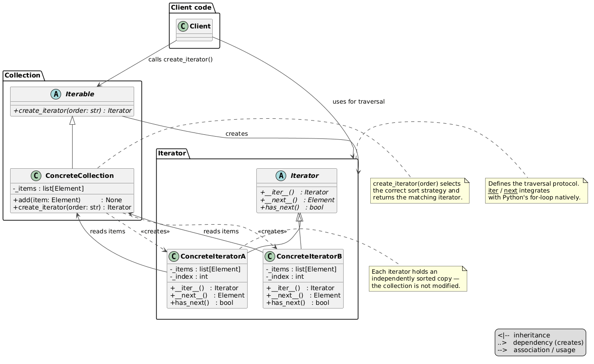

# Iterator Pattern

An implementation of the Iterator design pattern for a book collection — three independent iterators traverse the same list of books in ascending order by author, title, or year, without exposing the underlying list or sort logic to the client.



## Problem and Solution

### The Problem
Without the pattern, the client must know the collection's internal structure and implement sorting itself every time it needs a different traversal order:

```python
books = [
    Book("Orwell, George",  "1984",            1949),
    Book("Tolkien, J.R.R.", "The Hobbit",      1937),
    Book("Huxley, Aldous",  "Brave New World", 1932),
]

# client must sort manually each time
for book in sorted(books, key=lambda b: b.year):
    print(book)

for book in sorted(books, key=lambda b: b.author):
    print(book)
```

### The Solution
The collection creates iterators on demand. The client picks a traversal order and iterates — no sorting logic, no knowledge of internals:

```python
from behavioral.iterator.book import Book
from behavioral.iterator.book_collection import BookCollection

collection = BookCollection()
collection.add(Book("Orwell, George",  "1984",            1949))
collection.add(Book("Tolkien, J.R.R.", "The Hobbit",      1937))
collection.add(Book("Huxley, Aldous",  "Brave New World", 1932))

for book in collection.create_iterator("year"):
    print(book)
# → Huxley, Aldous    | Brave New World | 1932
# → Tolkien, J.R.R.   | The Hobbit      | 1937
# → Orwell, George    | 1984            | 1949

for book in collection.create_iterator("author"):
    print(book)
# → Huxley, Aldous    | Brave New World | 1932
# → Orwell, George    | 1984            | 1949
# → Tolkien, J.R.R.   | The Hobbit      | 1937
```

## Pattern Overview

- **BookInterface** (`book_interface.py`): ABC — declares `author`, `title`, `year` fields and enforces `__str__`
- **Book** (`book.py`): concrete element — dataclass implementing `BookInterface`
- **Iterator** (`iterator.py`): ABC — `__init__` sorts the collection via abstract `_sort_key`; provides concrete `__iter__`, `__next__`, `has_next`
- **AuthorIterator** (`iterators/author_iterator.py`): sorts ascending by `book.author`
- **TitleIterator** (`iterators/title_iterator.py`): sorts ascending by `book.title`
- **YearIterator** (`iterators/year_iterator.py`): sorts ascending by `book.year`
- **Iterable** (`iterable.py`): ABC — `create_iterator(order: str) → Iterator`
- **BookCollection** (`book_collection.py`): concrete collection — holds books, dispatches `create_iterator` to the correct iterator class

## Structure

```
behavioral/iterator/
├── __init__.py
├── __main__.py                  ← demo: all three sort orders
├── module_schema.txt
├── iterator.py                  ← Iterator ABC (common logic + abstract _sort_key)
├── iterable.py                  ← Iterable ABC
├── book_interface.py            ← BookInterface ABC
├── book.py                      ← Book (dataclass, implements BookInterface)
├── book_collection.py           ← BookCollection (concrete collection)
├── iterators/
│   ├── __init__.py
│   ├── author_iterator.py       ← AuthorIterator (_sort_key → book.author)
│   ├── title_iterator.py        ← TitleIterator  (_sort_key → book.title)
│   └── year_iterator.py         ← YearIterator   (_sort_key → book.year)
├── uml/
│   └── iterator_general.puml    ← abstract pattern diagram
└── tests/
    ├── __init__.py
    └── test_iterator.py
```

## Usage

### Run the demo:
```bash
python -m behavioral.iterator
```

### Run the tests:
```bash
python -m unittest behavioral.iterator.tests.test_iterator -v
```

## Key Components

### Iterator (`iterator.py`)
Common traversal logic lives here once. Subclasses only define `_sort_key`:

```python
class Iterator(ABC):
    def __init__(self, books: list[BookInterface]) -> None:
        self._books = sorted(books, key=self._sort_key)
        self._index = 0

    @abstractmethod
    def _sort_key(self, book: BookInterface) -> Any: ...

    def __next__(self) -> BookInterface:
        if not self.has_next():
            raise StopIteration
        book = self._books[self._index]
        self._index += 1
        return book
```

### BookCollection (`book_collection.py`)
Dispatches `create_iterator` to the correct class — the client never instantiates iterators directly:

```python
def create_iterator(self, order: str) -> Iterator:
    match order:
        case "author": return AuthorIterator(self._books)
        case "title":  return TitleIterator(self._books)
        case "year":   return YearIterator(self._books)
        case _: raise ValueError(f"Unknown order: '{order}'")
```

## UML Diagrams

### Abstract pattern diagram


### Structural diagram
See `uml/iterator_schema.puml`

## Difference from Related Patterns

| Pattern      | Intent |
|--------------|--------|
| **Iterator** | Separates traversal from the collection; multiple independent traversal strategies over the same data |
| **Composite**| Tree structure where nodes and leaves share an interface; not about traversal order |
| **Factory Method** | `create_iterator(order)` uses factory method to produce the correct iterator |
| **Strategy** | Swaps an algorithm at runtime; Iterator applies this idea specifically to traversal |
