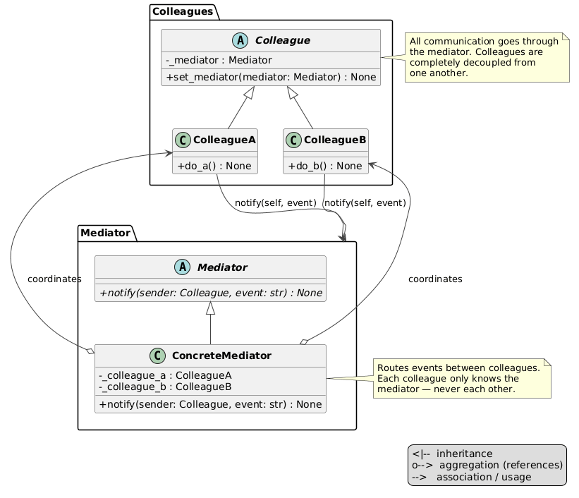

# Mediator Pattern

An implementation of the Mediator design pattern for a concierge service — a guest requests taxi, home master, or flower delivery through a single mediator that dispatches the request and notifies the guest on completion. No service knows about the guest or any other service directly.



## Problem and Solution

### The Problem
Without the pattern, the guest must hold references to every service and each service must know how to reach the guest back — every new service multiplies the connections:

```python
class Guest:
    def __init__(self, taxi, master, flowers):
        self.taxi = taxi
        self.master = master
        self.flowers = flowers

    def request_taxi(self):
        self.taxi.call(on_done=self.on_taxi_done)   # direct coupling

    def on_taxi_done(self):
        print("Taxi arrived")
```

### The Solution
Every participant only knows the mediator. The guest sends an event; the mediator routes it to the right service and delivers the response back:

```python
from behavioral.mediator.guest import Guest
from behavioral.mediator.concierge_mediator import ConciergeMediator
from behavioral.mediator.services import TaxiService, MasterService, FlowerDelivery

guest = Guest()
ConciergeMediator(guest=guest, taxi=TaxiService(), master=MasterService(), flowers=FlowerDelivery())

guest.request("taxi")
# TaxiService:: taxi is ready
# Guest :: Received message: Taxi is on its way
```

## Pattern Overview

- **Mediator** (`mediator.py`): ABC — single abstract method `notify(sender, event)`
- **ConciergeMediator** (`concierge_mediator.py`): concrete mediator — routes events by name; on request events calls the service, on `*_done` events notifies the guest
- **MediatorElement** (`mediator_element.py`): ABC — holds `_mediator` reference, exposes `set_mediator()`
- **Guest** (`guest.py`): colleague — calls `mediator.notify(self, service)` on `request()`; prints on `receive()`
- **TaxiService** (`services/taxi_service.py`): colleague — `handle()` dispatches taxi, then calls `mediator.notify(self, "taxi_done")`
- **MasterService** (`services/master_service.py`): colleague — same protocol for master dispatch
- **FlowerDelivery** (`services/flower_delivery.py`): colleague — same protocol for flower delivery

## Structure

```
behavioral/mediator/
├── __init__.py
├── __main__.py                    ← demo
├── module_schema.txt
├── mediator.py                    ← Mediator ABC
├── mediator_element.py            ← MediatorElement ABC (base colleague)
├── concierge_mediator.py          ← ConciergeMediator (concrete mediator)
├── guest.py                       ← Guest (initiates requests, receives replies)
├── services/
│   ├── __init__.py
│   ├── taxi_service.py            ← TaxiService
│   ├── master_service.py          ← MasterService
│   └── flower_delivery.py         ← FlowerDelivery
├── uml/
│   ├── mediator_general.puml      ← abstract pattern diagram
│   ├── mediator_schema.puml       ← concrete class diagram
│   └── mediator_flow.puml         ← sequence diagram
└── tests/
    ├── __init__.py
    └── test_mediator.py
```

## Usage

### Run the demo:
```bash
python -m behavioral.mediator
```

### Run the tests:
```bash
python -m unittest behavioral.mediator.tests.test_mediator -v
```

## Key Components

### ConciergeMediator (`concierge_mediator.py`)
Routes by event string — no colleague ever calls another directly:

```python
def notify(self, sender: MediatorElement, event: str) -> None:
    match event:
        case "taxi":         self._taxi.handle()
        case "master":       self._master.handle()
        case "flowers":      self._flowers.handle()
        case "taxi_done":    self._guest.receive("Taxi is on its way")
        case "master_done":  self._guest.receive("Master will arrive shortly")
        case "flowers_done": self._guest.receive("Flowers are on their way")
```

### Call Flow
```
guest.request("taxi")
  → mediator.notify(guest, "taxi")
    → taxi.handle()
      → mediator.notify(taxi, "taxi_done")
        → guest.receive("Taxi is on its way")
```

## UML Diagrams

### Abstract pattern diagram


### Concrete class diagram
See `uml/mediator_schema.puml`

### Sequence diagram
See `uml/mediator_flow.puml`

## Mediator vs Facade

Both put a single class in front of multiple others, but the intent and communication direction are opposite:

| | Mediator | Facade |
|---|---|---|
| **Direction** | Two-way — colleagues send events *to* the mediator and receive replies *back* | One-way — client calls facade, facade calls subsystems, nothing calls back |
| **Subsystem awareness** | Every colleague holds a `_mediator` reference and actively uses it | Subsystems are unaware the facade exists |
| **Coupling removed** | Between colleagues (Guest ↔ TaxiService ↔ MasterService) | Between client and subsystem internals |
| **Subsystem behaviour** | Colleagues are active — they initiate calls back through the mediator | Subsystems are passive — they only respond when called |
| **Added complexity** | Centralises logic; mediator grows as colleagues are added | Hides complexity; subsystems stay unchanged |

**Concrete example — the same concierge desk:**

```python
# Facade: client calls, service responds, nothing comes back through the desk
class ConciergeDesk:
    def call_taxi(self):
        self._taxi.dispatch()          # one direction only

# Mediator: taxi calls back through the mediator when done
class TaxiService(MediatorElement):
    def handle(self):
        self._mediator.notify(self, "taxi_done")  # reply path through mediator
```

The test: if a subsystem ever calls back through the central object → Mediator. If subsystems are silent after being called → Facade.

## Difference from Related Patterns

| Pattern      | Intent |
|--------------|--------|
| **Mediator** | Central hub coordinates two-way communication; colleagues send events back through it |
| **Facade**   | Simplifies a subsystem one-way; subsystems are passive and don't call back through the facade |
| **Observer** | One-to-many broadcast; publisher doesn't know observers; no central coordinator |
| **Chain of Responsibility** | Request walks a chain until handled; no central hub, no reply path |
