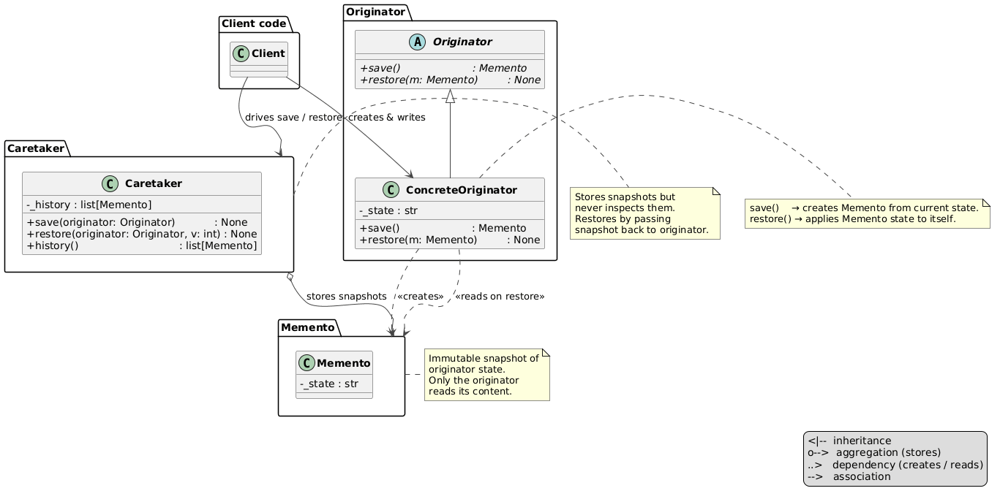
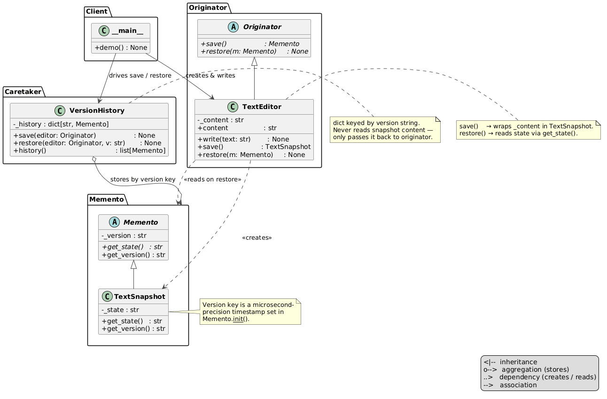

# Memento Pattern

An implementation of the Memento design pattern for a text editor — the editor saves snapshots of its content at any point, and a version history caretaker can restore any saved version by index without ever reading the snapshot's internal state.



## Problem and Solution

### The Problem
Without the pattern, the client must hold all previous states itself and expose the editor's internals to do so:

```python
content = ""
history = []

content = "First draft."
history.append(content)          # client copies the string manually

content = "Second draft."
history.append(content)

content = history[0]             # client reaches into raw state directly
```

### The Solution
The editor creates snapshots of itself on demand. The caretaker stores them without inspecting their contents. The client picks a version and restores — no raw state exposed:

```python
from behavioral.memento.text_editor import TextEditor
from behavioral.memento.caretaker import VersionHistory

editor = TextEditor()
history = VersionHistory()

editor.write("First draft.")
history.save(editor)

editor.write("Second draft.")
history.save(editor)

editor.write("Third draft.")
history.save(editor)

history.restore(editor, 0)
print(editor.content)   # → "First draft."

history.restore(editor, -1)
print(editor.content)   # → "Third draft."
```

## Pattern Overview

- **Memento** (`memento.py`): ABC — declares `get_content()` as the only interface exposed to the caretaker
- **TextSnapshot** (`text_snapshot.py`): concrete memento — stores the content string; only the originator reads it
- **Originator** (`originator.py`): ABC — declares `save() → Memento` and `restore(memento: Memento)`
- **TextEditor** (`text_editor.py`): concrete originator — holds `_content`, creates `TextSnapshot` on `save()`, reads it back on `restore()`
- **VersionHistory** (`caretaker.py`): caretaker — appends snapshots on `save()`, restores by index, never reads snapshot content

## Structure

```
behavioral/memento/
├── __init__.py
├── __main__.py              ← demo: write → save × 3 → restore by version
├── module_schema.txt
├── memento.py               ← Memento ABC
├── text_snapshot.py         ← TextSnapshot (concrete memento)
├── originator.py            ← Originator ABC
├── text_editor.py           ← TextEditor (concrete originator)
├── caretaker.py             ← VersionHistory (caretaker)
├── uml/
│   ├── memento_general.puml ← abstract pattern diagram
│   ├── memento_schema.puml  ← structural class diagram
│   └── memento_flow.puml    ← sequence diagram
└── tests/
    ├── __init__.py
    └── test_memento.py
```

## Usage

### Run the demo:
```bash
python -m behavioral.memento
```

### Run the tests:
```bash
python -m unittest behavioral.memento.tests.test_memento -v
```

## Key Components

### Memento (`memento.py`)
Defines the only interface the caretaker ever sees — `get_content()` is intentionally minimal so the caretaker cannot inspect or reconstruct state:

```python
class Memento(ABC):
    @abstractmethod
    def get_content(self) -> str: ...
```

### TextEditor (`text_editor.py`)
Creates and consumes snapshots. `save()` wraps current content; `restore()` unwraps it. The caretaker is never involved in either:

```python
def save(self) -> Memento:
    return TextSnapshot(self._content)

def restore(self, memento: Memento) -> None:
    self._content = memento.get_content()
```

### VersionHistory (`caretaker.py`)
Stores snapshots and restores by index. Wraps `IndexError` as a descriptive `RuntimeError`:

```python
def restore(self, editor: Originator, version: int) -> None:
    try:
        editor.restore(self._history[version])
    except IndexError:
        raise RuntimeError(f"Version {version} does not exist")
```

Supports standard Python negative indexing — `version=-1` always restores the last saved snapshot.

## UML Diagrams

### Structural diagram
See `uml/memento_schema.puml`


### Sequence diagram
See `uml/memento_flow.puml`

## Difference from Related Patterns

| Pattern | Intent |
|---------|--------|
| **Memento** | Snapshots the originator's **state** so it can be restored later. Caretaker stores snapshots but never reads them. Undo is "go back to this exact state." |
| **Command** | Encapsulates an **operation** so it can be executed and undone. Each command knows how to reverse itself — no full copy of state needed. |
| **Key distinction** | Memento saves **what it was**. Command saves **what was done and how to undo it**. |
| **When to use Memento** | When reversing an operation is impractical (complex transformations, external state). Restore any arbitrary version directly by index. |
| **When to use Command** | When operations are well-defined and invertible. Undo walks history step-by-step; no full copies needed. |
| **Combined** | Command for step-by-step undo/redo + Memento for "save point" restore across many operations at once. |
