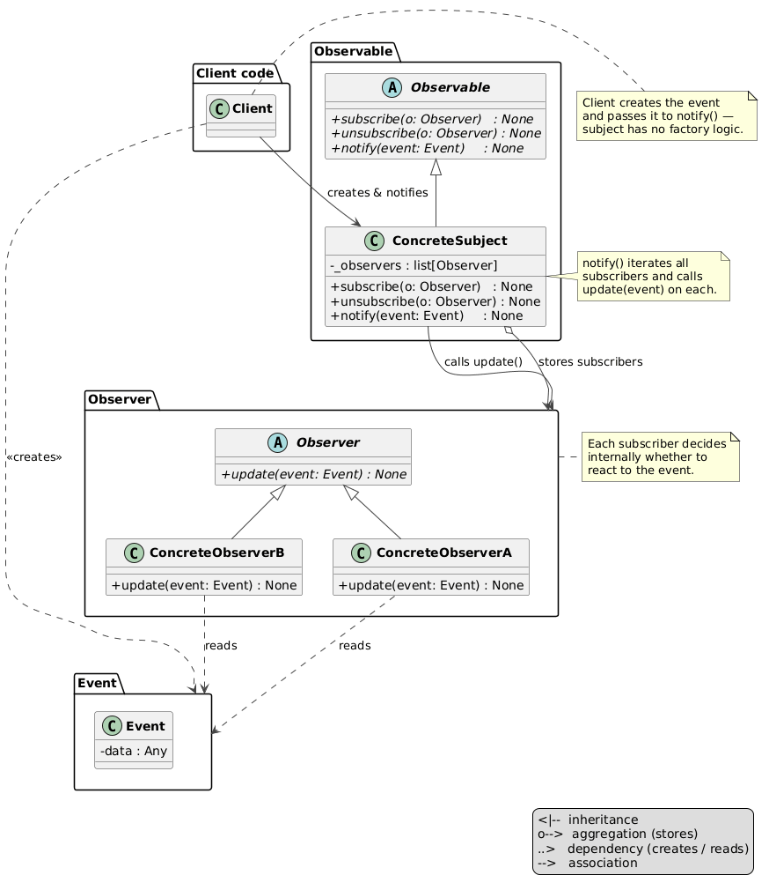
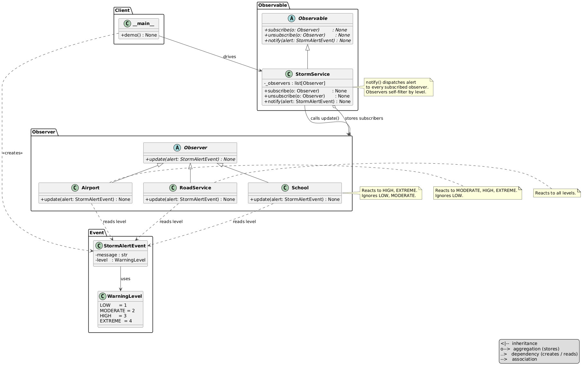

# Observer Pattern

An implementation of the Observer design pattern for a storm warning service — the service publishes alerts at four severity levels, and each subscriber (school, airport, road service) reacts only to the levels relevant to them.



## Problem and Solution

### The Problem
Without the pattern, the service must know about every subscriber type and call each one explicitly — adding a new subscriber requires changing the service:

```python
def issue_alert(level, message):
    if level >= HIGH:
        school.cancel_classes()
    if level >= MODERATE:
        airport.restrict_flights()
    road_service.prepare(level)   # service hard-wires every subscriber
```

### The Solution
Subscribers register themselves with the service. The service broadcasts to all of them — it knows nothing about their logic. New subscribers can be added without touching the service:

```python
from behavioral.observer.storm_alert_event import StormAlertEvent, WarningLevel
from behavioral.observer.storm_service import StormService
from behavioral.observer.subscribers.school import School
from behavioral.observer.subscribers.airport import Airport
from behavioral.observer.subscribers.road_service import RoadService

service = StormService()
service.subscribe(School())
service.subscribe(Airport())
service.subscribe(RoadService())

service.notify(StormAlertEvent(level=WarningLevel.HIGH, message="Severe storm approaching."))
# → [School] Cancelling classes — Severe storm approaching.
# → [Airport] Suspending all flights — Severe storm approaching.
# → [RoadService] Closing highways — Severe storm approaching.

service.notify(StormAlertEvent(level=WarningLevel.LOW, message="Light storm expected."))
# → [RoadService] Pre-treating roads — Light storm expected.
```

## Pattern Overview

- **WarningLevel** (`storm_alert_event.py`): `IntEnum` — `LOW=1`, `MODERATE=2`, `HIGH=3`, `EXTREME=4`
- **StormAlertEvent** (`storm_alert_event.py`): frozen dataclass — `message`, `level`; created by the client and passed directly to `notify()`
- **Observer** (`observer.py`): ABC — declares `update(alert: StormAlertEvent)`
- **School** (`subscribers/school.py`): reacts to `HIGH` (cancel classes) and `EXTREME` (emergency closure)
- **Airport** (`subscribers/airport.py`): reacts to `MODERATE` (restrict departures), `HIGH` (suspend flights), `EXTREME` (close airport)
- **RoadService** (`subscribers/road_service.py`): reacts to all four levels
- **Observable** (`observable.py`): ABC — declares `subscribe`, `unsubscribe`, `notify`
- **StormService** (`storm_service.py`): concrete subject — maintains `_observers` list, dispatches alerts

## Structure

```
behavioral/observer/
├── __init__.py
├── __main__.py                  ← demo: subscribe all → alerts at each level
├── module_schema.txt
├── observer.py                  ← Observer ABC
├── observable.py                ← Observable ABC
├── storm_alert_event.py         ← WarningLevel (IntEnum) + StormAlertEvent (dataclass)
├── storm_service.py             ← StormService (concrete subject)
├── subscribers/
│   ├── __init__.py
│   ├── school.py                ← School       (reacts to HIGH, EXTREME)
│   ├── airport.py               ← Airport      (reacts to MODERATE+)
│   └── road_service.py          ← RoadService  (reacts to all levels)
├── uml/
│   ├── observer_general.puml    ← abstract pattern diagram
│   ├── observer_schema.puml     ← structural class diagram
│   └── observer_flow.puml       ← sequence diagram
└── tests/
    ├── __init__.py
    └── test_observer.py
```

## Usage

### Run the demo:
```bash
python -m behavioral.observer
```

### Run the tests:
```bash
python -m unittest behavioral.observer.tests.test_observer -v
```

## Key Components

### StormService (`storm_service.py`)
Broadcasts to all subscribers — no knowledge of their types or thresholds:

```python
def notify(self, alert: StormAlertEvent) -> None:
    for observer in self._observers:
        observer.update(alert)
```

### Subscribers (`subscribers/`)
Each subscriber decides internally which levels to handle via `match/case`. Unmatched levels are silently ignored:

```python
class Airport(Observer):
    def update(self, alert: StormAlertEvent) -> None:
        match alert.level:
            case WarningLevel.MODERATE:
                print(f"[Airport] Restricting departures — {alert.message}")
            case WarningLevel.HIGH:
                print(f"[Airport] Suspending all flights — {alert.message}")
            case WarningLevel.EXTREME:
                print(f"[Airport] Closing airport — {alert.message}")
```

### Event creation (`__main__.py`)
`StormAlertEvent` is created by the client and passed directly to `notify()` — the service has no factory method:

```python
service.notify(StormAlertEvent(level=WarningLevel.EXTREME, message="Hurricane warning issued."))
```

## UML Diagrams

### Abstract pattern diagram


### Structural diagram
See `uml/observer_schema.puml`


### Sequence diagram
See `uml/observer_flow.puml`

## Difference from Related Patterns

| Pattern | Intent |
|---------|--------|
| **Observer** | One subject broadcasts to many subscribers. Subscribers self-select what they react to inside `update()`. |
| **Mediator** | Many-to-many. Components talk through a central mediator instead of directly. Mediator decides who gets what. |
| **Command** | Encapsulates a request as an object. No subscription model — the invoker explicitly runs each command. |
| **Key distinction** | Observer: subject broadcasts, subscribers self-select. Mediator: mediator routes, components stay decoupled from each other. |
