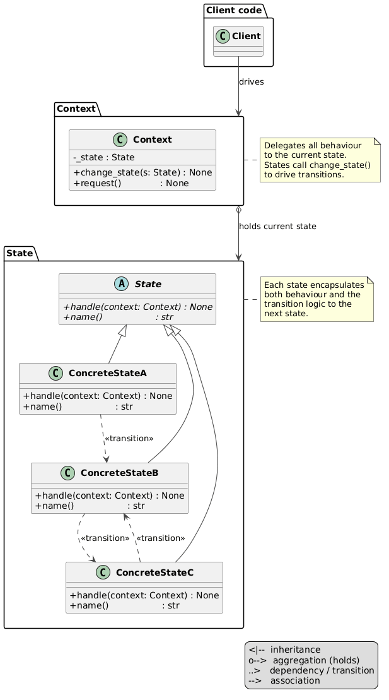

# State Pattern

An implementation of the State design pattern for a pizza oven — the oven moves through three states (Cold, Ready, Overheated), each defining its own behaviour for `heat_up()`, `cool_down()`, and `bake()`. Illegal operations raise `RuntimeError`; transitions are driven by the states themselves.



## Problem and Solution

### The Problem
Without the pattern, the context accumulates a growing `if/elif` chain for every operation:

```python
def bake(self, pizza: str) -> None:
    if self._state == "cold":
        raise RuntimeError("Cannot bake — oven is cold.")
    elif self._state == "ready":
        print(f"Baking '{pizza}'...")
    elif self._state == "overheated":
        raise RuntimeError("Cannot bake — oven is overheated.")
```

Adding a new state or operation means editing the context every time.

### The Solution
Each state is a class. The context delegates blindly; states own both behaviour and transition logic:

```python
from behavioral.state.pizza_oven import PizzaOven

oven = PizzaOven()          # starts Cold

oven.heat_up()              # Cold → Ready
oven.bake("Margherita")     # → "Baking 'Margherita' — perfect temperature!"

oven.heat_up()              # Ready → Overheated
oven.bake("Pepperoni")      # → RuntimeError: Cannot bake — oven is overheated.

oven.cool_down()            # Overheated → Ready
oven.bake("Diavola")        # → "Baking 'Diavola' — perfect temperature!"
```

## Pattern Overview

- **OvenState** (`oven_state.py`): ABC — declares `heat_up`, `cool_down`, `bake`, `name`
- **ColdState** (`states/cold_state.py`): initial state — `heat_up` → Ready; `cool_down` and `bake` raise `RuntimeError`
- **ReadyState** (`states/ready_state.py`): `bake` works; `heat_up` → Overheated; `cool_down` → Cold
- **OverheatedState** (`states/overheated_state.py`): `cool_down` → Ready; `heat_up` and `bake` raise `RuntimeError`
- **PizzaOven** (`pizza_oven.py`): context — holds `_state`, delegates all calls, exposes `change_state()`

## State Transition Table

| State | `heat_up()` | `cool_down()` | `bake()` |
|---|---|---|---|
| **Cold** | → Ready | `RuntimeError` | `RuntimeError` |
| **Ready** | → Overheated | → Cold | bakes pizza ✓ |
| **Overheated** | `RuntimeError` | → Ready | `RuntimeError` |

## Structure

```
behavioral/state/
├── __init__.py
├── __main__.py                  ← demo: full bake cycle + all error cases
├── module_schema.txt
├── oven_state.py                ← OvenState ABC
├── pizza_oven.py                ← PizzaOven (context)
├── states/
│   ├── __init__.py
│   ├── cold_state.py            ← ColdState
│   ├── ready_state.py           ← ReadyState
│   └── overheated_state.py      ← OverheatedState
├── uml/
│   ├── state_general.puml       ← abstract pattern diagram
│   ├── state_schema.puml        ← structural class diagram
│   └── state_flow.puml          ← sequence diagram
└── tests/
    ├── __init__.py
    └── test_state.py
```

## Usage

### Run the demo:
```bash
python -m behavioral.state
```

### Run the tests:
```bash
python -m unittest behavioral.state.tests.test_state -v
```

## Key Components

### OvenState (`oven_state.py`)
Circular import with `PizzaOven` is avoided via `TYPE_CHECKING` — the import runs only during static analysis, not at runtime:

```python
from typing import TYPE_CHECKING

if TYPE_CHECKING:
    from .pizza_oven import PizzaOven
```

### PizzaOven (`pizza_oven.py`)
The context stays completely thin — no conditionals, no knowledge of state logic:

```python
def heat_up(self) -> None:
    self._state.heat_up(self)

def bake(self, pizza: str) -> None:
    self._state.bake(self, pizza)
```

### States (`states/`)
Each state drives its own transition by calling `context.change_state()`. Next-state classes are imported locally inside the method to avoid circular imports between state files:

```python
class ColdState(OvenState):
    def heat_up(self, context: PizzaOven) -> None:
        from .ready_state import ReadyState
        context.change_state(ReadyState())
        print("[Oven] Heating up — oven is ready to bake.")
```

## UML Diagrams

### Abstract pattern diagram


### Structural diagram
See `uml/state_schema.puml`

### Sequence diagram
See `uml/state_flow.puml`

## Difference from Related Patterns

| Pattern | Intent |
|---------|--------|
| **State** | Object changes behaviour when its internal state changes. States drive transitions by calling `change_state()` on the context. |
| **Strategy** | Swaps an algorithm at runtime from outside. The object does not drive the swap — the client does. No concept of transitions. |
| **Key distinction** | State: object transitions itself. Strategy: client selects the algorithm. |
