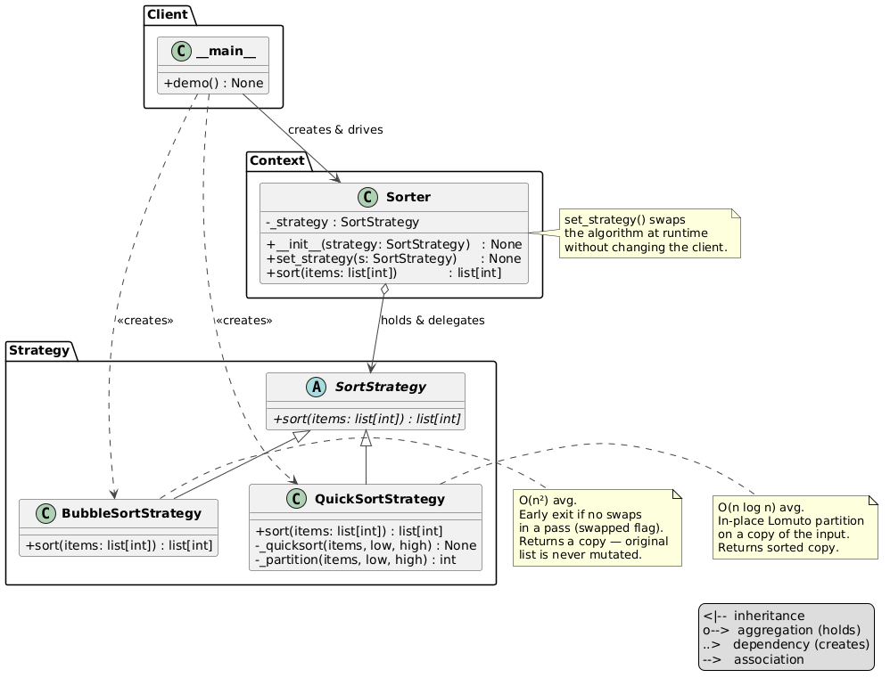

# Strategy Pattern

An implementation of the Strategy design pattern for a list sorter — two interchangeable sorting algorithms (Bubble Sort and Quick Sort) can be swapped at runtime without modifying the sorter or the client.


## Problem and Solution

### The Problem
Without the pattern, the sorter contains all algorithms and a conditional to pick between them — adding a new algorithm requires editing the class:

```python
def sort(self, items: list[int], algorithm: str) -> list[int]:
    if algorithm == "bubble":
        # bubble sort logic...
    elif algorithm == "quick":
        # quick sort logic...
```

### The Solution
Each algorithm is its own class. The sorter delegates to whichever strategy it holds — the client picks and swaps:

```python
from behavioral.strategy.sorter import Sorter
from behavioral.strategy.strategies.bubble_sort import BubbleSortStrategy
from behavioral.strategy.strategies.quick_sort import QuickSortStrategy

data = [64, 34, 25, 12, 22, 11, 90]

sorter = Sorter(BubbleSortStrategy())
print(sorter.sort(data))   # → [11, 12, 22, 25, 34, 64, 90]

sorter.set_strategy(QuickSortStrategy())
print(sorter.sort(data))   # → [11, 12, 22, 25, 34, 64, 90]

print(data)                # → [64, 34, 25, 12, 22, 11, 90]  (unchanged)
```

## Pattern Overview

- **SortStrategy** (`sort_strategy.py`): ABC — declares `sort(items: list[int]) -> list[int]`
- **BubbleSortStrategy** (`strategies/bubble_sort.py`): O(n²) comparison-swap with early-exit optimisation (`swapped` flag); returns a sorted copy
- **QuickSortStrategy** (`strategies/quick_sort.py`): O(n log n) average; in-place Lomuto partition on a copy of the input; returns a sorted copy
- **Sorter** (`sorter.py`): context — holds the current strategy, exposes `set_strategy()` for runtime swapping, delegates `sort()` entirely

## Structure

```
behavioral/strategy/
├── __init__.py
├── __main__.py                  ← demo: same list sorted by both strategies + edge cases
├── module_schema.txt
├── sort_strategy.py             ← SortStrategy ABC
├── sorter.py                    ← Sorter (context)
├── strategies/
│   ├── __init__.py
│   ├── bubble_sort.py           ← BubbleSortStrategy
│   └── quick_sort.py            ← QuickSortStrategy
├── uml/
│   ├── strategy_general.puml    ← abstract pattern diagram
│   ├── strategy_schema.puml     ← structural class diagram
│   └── strategy_flow.puml       ← sequence diagram
└── tests/
    ├── __init__.py
    └── test_strategy.py
```

## Usage

### Run the demo:
```bash
python -m behavioral.strategy
```

### Run the tests:
```bash
python -m unittest behavioral.strategy.tests.test_strategy -v
```

## Key Components

### SortStrategy (`sort_strategy.py`)
Minimal ABC — one method, consistent signature across all algorithms:

```python
class SortStrategy(ABC):
    @abstractmethod
    def sort(self, items: list[int]) -> list[int]: ...
```

### BubbleSortStrategy (`strategies/bubble_sort.py`)
Copies input first, then sorts in-place. Early exits when a pass produces no swaps:

```python
def sort(self, items: list[int]) -> list[int]:
    result = items.copy()
    for i in range(len(result) - 1):
        swapped = False
        for j in range(len(result) - i - 1):
            if result[j] > result[j + 1]:
                result[j], result[j + 1] = result[j + 1], result[j]
                swapped = True
        if not swapped:
            break
    return result
```

### QuickSortStrategy (`strategies/quick_sort.py`)
Copies input, then sorts in-place using Lomuto partition:

```python
def sort(self, items: list[int]) -> list[int]:
    result = items.copy()
    self._quicksort(result, 0, len(result) - 1)
    return result
```

### Sorter (`sorter.py`)
Context stays completely thin — no algorithm logic, just delegation:

```python
def sort(self, items: list[int]) -> list[int]:
    return self._strategy.sort(items)
```

## Algorithm Comparison

| Strategy | Best | Average | Worst | Notes |
|---|---|---|---|---|
| `BubbleSortStrategy` | O(n) | O(n²) | O(n²) | Simple; good for nearly-sorted data |
| `QuickSortStrategy` | O(n log n) | O(n log n) | O(n²) | Fast in practice; worst case on sorted input |

## UML Diagrams

### Abstract pattern diagram


### Structural diagram
See `uml/strategy_schema.puml`


### Sequence diagram
See `uml/strategy_flow.puml`

## Difference from Related Patterns

| Pattern | Intent |
|---------|--------|
| **Strategy** | Client selects and swaps the algorithm at runtime. Context delegates — no conditionals. |
| **State** | Object transitions itself between states. The object drives the swap, not the client. |
| **Template Method** | Algorithm skeleton fixed in base class; subclasses override specific steps. Structure cannot change. |
| **Key distinction** | Strategy: whole algorithm is swappable. Template Method: structure fixed, only steps vary. |
