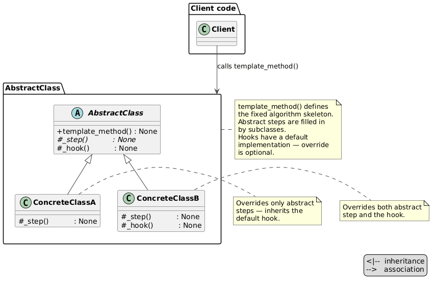
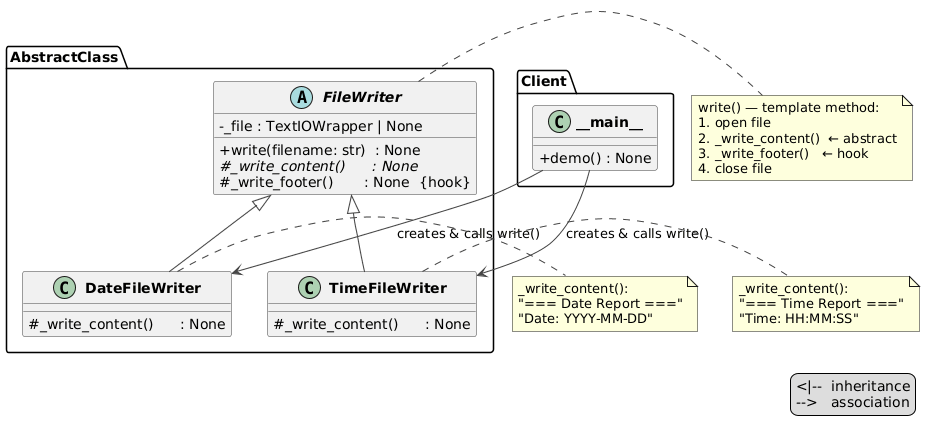

# Template Method Pattern

An implementation of the Template Method design pattern for a file writer — the base class defines the fixed algorithm (open → content → footer → close), and subclasses fill in only `_write_content()` to write the current date or current time.



## Problem and Solution

### The Problem
Without the pattern, each writer duplicates the full file-handling algorithm — any structural change must be applied everywhere:

```python
class DateWriter:
    def write(self, filename):
        with open(filename, "w") as f:
            f.write("=== Date Report ===\n")
            f.write(f"Date: {datetime.now().strftime('%Y-%m-%d')}\n")
            f.write("\n" + "=" * 30 + "\n")   # duplicated in every writer

class TimeWriter:
    def write(self, filename):
        with open(filename, "w") as f:
            f.write("=== Time Report ===\n")
            f.write(f"Time: {datetime.now().strftime('%H:%M:%S')}\n")
            f.write("\n" + "=" * 30 + "\n")   # duplicated again
```

### The Solution
The algorithm lives once in the base class. Subclasses implement only `_write_content()`:

```python
from behavioral.template.writers.date_file_writer import DateFileWriter
from behavioral.template.writers.time_file_writer import TimeFileWriter

DateFileWriter().write("date_report.txt")
TimeFileWriter().write("time_report.txt")
```

**`date_report.txt`:**
```
=== Date Report ===
Date: 2026-06-12

==============================
```

**`time_report.txt`:**
```
=== Time Report ===
Time: 10:45:30

==============================
```

## Pattern Overview

- **FileWriter** (`file_writer.py`): abstract class — `write()` is the template method; `_write_content()` is abstract; `_write_footer()` is a hook with a default separator line
- **DateFileWriter** (`writers/date_file_writer.py`): writes `"=== Date Report ==="` header and current date in `YYYY-MM-DD` format
- **TimeFileWriter** (`writers/time_file_writer.py`): writes `"=== Time Report ==="` header and current time in `HH:MM:SS` format

## Structure

```
behavioral/template/
├── __init__.py
├── __main__.py                    ← demo: writes both files to a temp dir
├── module_schema.txt
├── file_writer.py                 ← FileWriter ABC (template method)
├── writers/
│   ├── __init__.py
│   ├── date_file_writer.py        ← DateFileWriter
│   └── time_file_writer.py        ← TimeFileWriter
├── uml/
│   ├── template_general.puml      ← abstract pattern diagram
│   ├── template_schema.puml       ← structural class diagram
│   └── template_flow.puml         ← sequence diagram
└── tests/
    ├── __init__.py
    └── test_template.py
```

## Usage

### Run the demo:
```bash
python -m behavioral.template
```

### Run the tests:
```bash
python -m unittest behavioral.template.tests.test_template -v
```

## Key Components

### FileWriter (`file_writer.py`)
`write()` is the template method — controls the full algorithm, calls abstract and hook steps:

```python
def write(self, filename: str) -> None:
    with open(filename, "w") as file:
        self._file = file
        self._write_content()   # abstract — subclass must implement
        self._write_footer()    # hook    — default writes separator
```

### Hook vs Abstract step
`_write_footer()` is a **hook** — it has a default implementation (30 `=` separator) that subclasses can override but don't have to. `_write_content()` is **abstract** — every subclass must implement it.

### Subclasses (`writers/`)
Each subclass is a single method — no file-handling logic, no duplication:

```python
class DateFileWriter(FileWriter):
    def _write_content(self) -> None:
        self._file.write("=== Date Report ===\n")
        self._file.write(f"Date: {datetime.now().strftime('%Y-%m-%d')}\n")
```

## UML Diagrams


### Structural diagram
See `uml/template_schema.puml`


### Sequence diagram
See `uml/template_flow.puml`

## Difference from Related Patterns

| Pattern | Intent |
|---------|--------|
| **Template Method** | Algorithm structure fixed in base class. Subclasses override specific steps. Extension via inheritance. |
| **Strategy** | Whole algorithm swappable at runtime via composition. Extension via delegation, not inheritance. |
| **Key distinction** | Template Method: structure fixed, steps vary (inheritance). Strategy: structure varies, swapped by client (composition). |
