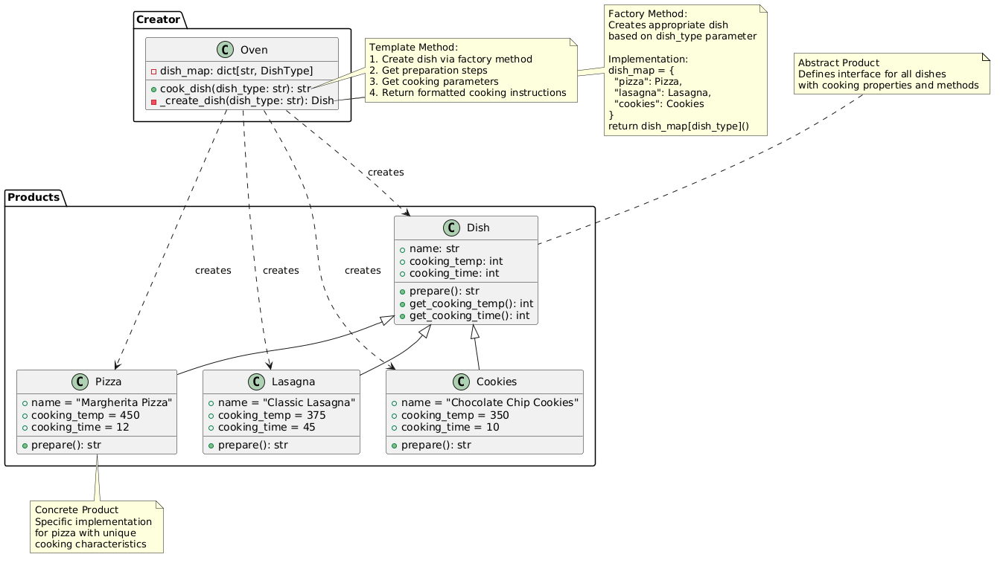

# Factory Method Pattern

An implementation of the Factory Method design pattern using a unified oven system that can create different types of dishes.

## Problem and Solution

### The Problem
When designing applications that need to create objects dynamically, you often encounter these challenges:

- **Tight Coupling**: Direct instantiation using constructors couples your code to specific concrete classes
- **Violates Open/Closed Principle**: Adding new object types requires modifying existing creation logic
- **Centralized Creation Logic**: All object creation concentrated in one place becomes unwieldy and hard to maintain
- **No Polymorphic Creation**: Cannot delegate object creation to specialized methods that know best how to create their products

For example, imagine a cooking application that needs to prepare different dishes. Without proper abstraction, you might end up with code like:
```python
def prepare_dish(dish_type):
    if dish_type == "pizza":
        # Complex pizza creation logic
        return Pizza(name="Margherita", temp=450, time=12)
    elif dish_type == "lasagna":
        # Complex lasagna creation logic
        return Lasagna(name="Classic", temp=375, time=45)
    elif dish_type == "cookies":
        # Complex cookie creation logic
        return Cookies(name="Chocolate Chip", temp=350, time=10)
    # Adding new dishes requires modifying this function
```

### The Solution
The Factory Method pattern solves these problems by:

1. **Defining a Creation Interface**: Factory method that creates objects based on parameters
2. **Centralizing Creation Logic**: Single method responsible for object creation decisions
3. **Encapsulating Creation Logic**: Complex object creation is contained within a specialized method
4. **Enabling Extensibility**: New product types can be added by extending the factory method

In our cooking example:
```python
# Single oven can create any type of dish
oven = Oven()
pizza = oven.cook_dish("pizza")      # Creates perfect pizza
lasagna = oven.cook_dish("lasagna")  # Creates perfect lasagna
cookies = oven.cook_dish("cookies")  # Creates perfect cookies
```

## Pattern Overview

The Factory Method pattern provides a method for creating objects based on input parameters. In this implementation:

- **Products**: Different types of dishes (Pizza, Lasagna, Cookies)
- **Creator**: Unified Oven class that creates different dishes
- **Factory Method**: `_create_dish()` method that produces the appropriate dish type
- **Template Method**: `cook_dish()` method that defines the common cooking process

## Structure

```
factory_method/
├── __init__.py          ← Public API
├── __main__.py          ← Demo script
├── oven.py              ← Creator class with factory method
└── dishes/              ← Product classes
    ├── __init__.py
    ├── base.py          ← Abstract Dish
    ├── pizza.py         ← Concrete Pizza
    ├── lasagna.py       ← Concrete Lasagna
    └── cookies.py       ← Concrete Cookies
```

## Usage

### As a module:

```python
from creational.factory_method import Oven

# Create oven and cook different dishes
oven = Oven()

# Cook various dishes
pizza_result = oven.cook_dish('pizza')
lasagna_result = oven.cook_dish('lasagna')
cookies_result = oven.cook_dish('cookies')

print(pizza_result)
print(lasagna_result)
print(cookies_result)
```

### Run the demo:
```bash
python -m factory_method
```

## Key Components

1. **Abstract Product** (`Dish`): Defines interface for all dishes with cooking properties
2. **Concrete Products** (`Pizza`, `Lasagna`, `Cookies`): Specific dish implementations with unique characteristics
3. **Creator** (`Oven`): Contains factory method `_create_dish()` and template method `cook_dish()`
4. **Factory Method**: `_create_dish()` creates appropriate dish based on dish type parameter
5. **Template Method**: `cook_dish()` defines consistent cooking process for all dishes

## Supported Dishes

### 🍕 Pizza (Margherita)
- Cooking Temperature: 450°F
- Cooking Time: 12 minutes
- Preparation: Rolling dough and adding margherita toppings

### 🍝 Lasagna (Classic)
- Cooking Temperature: 375°F
- Cooking Time: 45 minutes
- Preparation: Layering pasta, meat sauce, and cheese

### 🍪 Cookies (Chocolate Chip)
- Cooking Temperature: 350°F
- Cooking Time: 10 minutes
- Preparation: Mixing dough and placing chocolate chips

## Benefits

- **Simplicity**: Single oven handles all dish types through one interface
- **Extensibility**: Easy to add new dish types by extending the dish mapping
- **Template Method**: Common cooking process ensures consistent results
- **Type Safety**: Factory method ensures correct dish type creation
- **Centralized Logic**: All creation logic in one place for easy maintenance

## UML Diagram

See [factory_method_uml.puml](factory_method_uml.puml) for the complete UML class diagram.

