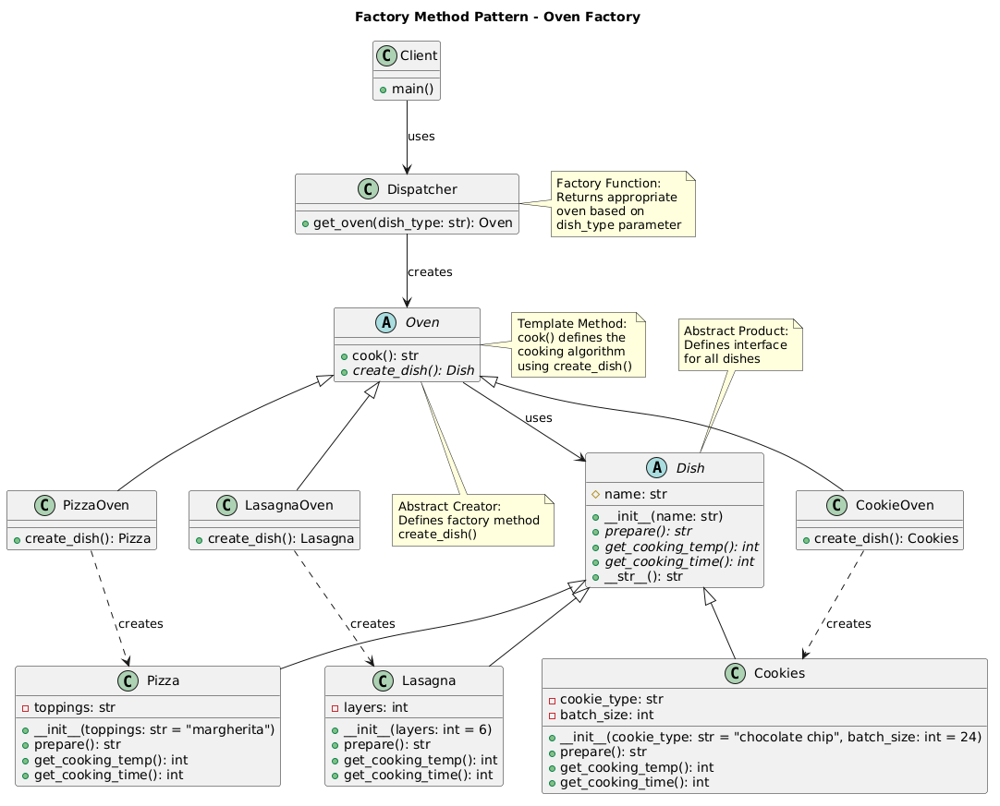

# Factory Method Pattern

An implementation of the Factory Method design pattern using an oven and dish cooking system.

## Problem and Solution

### The Problem
When designing applications that need to create objects dynamically, you often encounter these challenges:

- **Tight Coupling**: Direct instantiation using constructors couples your code to specific concrete classes
- **Violates Open/Closed Principle**: Adding new object types requires modifying existing creation logic
- **Centralized Creation Logic**: All object creation concentrated in one place becomes unwieldy and hard to maintain
- **No Polymorphic Creation**: Cannot delegate object creation to specialized classes that know best how to create their products

For example, imagine a cooking application that needs to prepare different dishes. Without proper abstraction, you might end up with code like:
```python
def prepare_dish(dish_type):
    if dish_type == "pizza":
        # Complex pizza creation logic
        return Pizza(dough="thin", sauce="tomato", cheese="mozzarella")
    elif dish_type == "lasagna":
        # Complex lasagna creation logic
        return Lasagna(layers=6, sauce="bechamel", pasta="fresh")
    elif dish_type == "cookies":
        # Complex cookie creation logic
        return Cookies(type="chocolate_chip", count=12)
    # Adding new dishes requires modifying this function
```

### The Solution
The Factory Method pattern solves these problems by:

1. **Defining a Creation Interface**: Abstract factory method that subclasses must implement
2. **Delegating Creation**: Each concrete creator knows how to create its specific product type
3. **Encapsulating Creation Logic**: Complex object creation is contained within specialized creator classes
4. **Enabling Polymorphism**: Clients work with abstract creators, allowing dynamic creation behavior

In our cooking example:
```python
# Each oven knows exactly how to create its specialized dish
pizza_oven = PizzaOven()
dish = pizza_oven.cook()  # Creates perfect pizza with proper settings

# Adding new dish types doesn't require changing existing code
cookie_oven = CookieOven()
cookies = cookie_oven.cook()  # Creates perfect cookies
```

## Pattern Overview

The Factory Method pattern provides an interface for creating objects, but lets subclasses decide which class to instantiate. In this implementation:

- **Products**: Different types of dishes (Pizza, Lasagna, Cookies)
- **Creators**: Different types of ovens that create specific dishes
- **Factory Method**: Each oven implements `create_dish()` to produce its specialized dish

## Structure

```
factory_method/
  __init__.py          � Public API
  __main__.py          � Demo script
  dispatcher.py        � Factory function get_oven()
  dishes/              � Product classes
    base.py            � Abstract Dish
    pizza.py           � Concrete Pizza
    lasagna.py         � Concrete Lasagna
    cookies.py         � Concrete Cookies
  ovens/               � Creator classes
    base.py            � Abstract Oven with template method
    pizza_oven.py      � Concrete PizzaOven
    lasagna_oven.py    � Concrete LasagnaOven
    cookie_oven.py     � Concrete CookieOven
```

## Usage

### As a module:
```python
from factory_method import get_oven

# Get the appropriate oven for your dish
pizza_oven = get_oven('pizza')
result = pizza_oven.cook()
print(result)
```

### Run the demo:
```bash
python -m factory_method
```

## Key Components

1. **Abstract Product** (`Dish`): Defines interface for dishes
2. **Concrete Products** (`Pizza`, `Lasagna`, `Cookies`): Specific dish implementations
3. **Abstract Creator** (`Oven`): Defines factory method and template method for cooking
4. **Concrete Creators** (`PizzaOven`, `LasagnaOven`, `CookieOven`): Implement factory method
5. **Dispatcher**: Factory function that returns appropriate oven based on dish type

## Benefits

- **Extensibility**: Easy to add new dish types and corresponding ovens
- **Separation of Concerns**: Each oven knows how to create its specific dish
- **Template Method**: Common cooking process defined in base oven class
- **Type Safety**: Each oven creates the correct dish type

## Diagram

