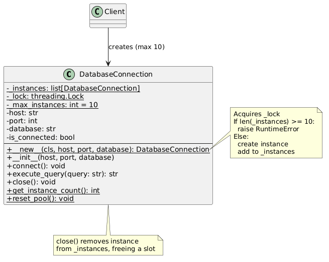
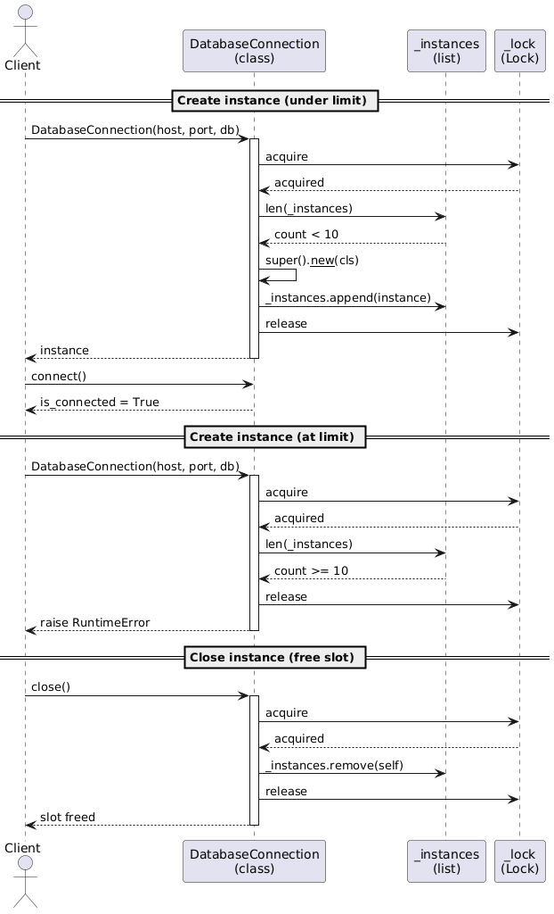

# Limited Singleton Pattern

Ensures a class has at most N instances (10 in this example), using a database connection pool as a practical scenario.

## Problem

Unrestricted instance creation can exhaust expensive resources like database connections:

```python
# No limit - can create hundreds of connections
for i in range(100):
    conn = DatabaseConnection("localhost", 5432, "mydb")
```

## Solution

The Limited Singleton enforces a cap via `__new__`:

```python
# Only 10 instances allowed
conns = [DatabaseConnection("localhost", 5432, f"db_{i}") for i in range(10)]

# 11th raises RuntimeError
DatabaseConnection("localhost", 5432, "db_11")  # RuntimeError!
```

Closing a connection frees a slot:

```python
conns[0].close()
new_conn = DatabaseConnection("localhost", 5432, "db_new")  # OK
```

## Structure

```
singleton/
├── __init__.py              <- Public API
├── __main__.py              <- Demo script
├── database_connection.py   <- Limited Singleton implementation
```

## Usage

```python
from singleton import DatabaseConnection

db = DatabaseConnection("localhost", 5432, "app_db")
db.connect()
result = db.execute_query("SELECT * FROM users")
db.close()
```

### Run the demo

```bash
python -m singleton
```

## How It Works

- `__new__` checks the instance count against the limit (protected by a threading lock)
- If under the limit, a new instance is created and tracked in a class-level list
- If at the limit, a `RuntimeError` is raised
- `close()` removes the instance from the list, freeing a slot
- `reset_pool()` clears all tracked instances

## UML Diagrams

Class diagram: [singleton_uml.puml](singleton_uml.puml)


Sequence diagram: [singleton_flow.puml](singleton_flow.puml)


## Useful links
[N+1 variations of a Singleton in Python](https://dev.to/0x808080/n1-variations-of-a-singleton-in-python-3j4m)
