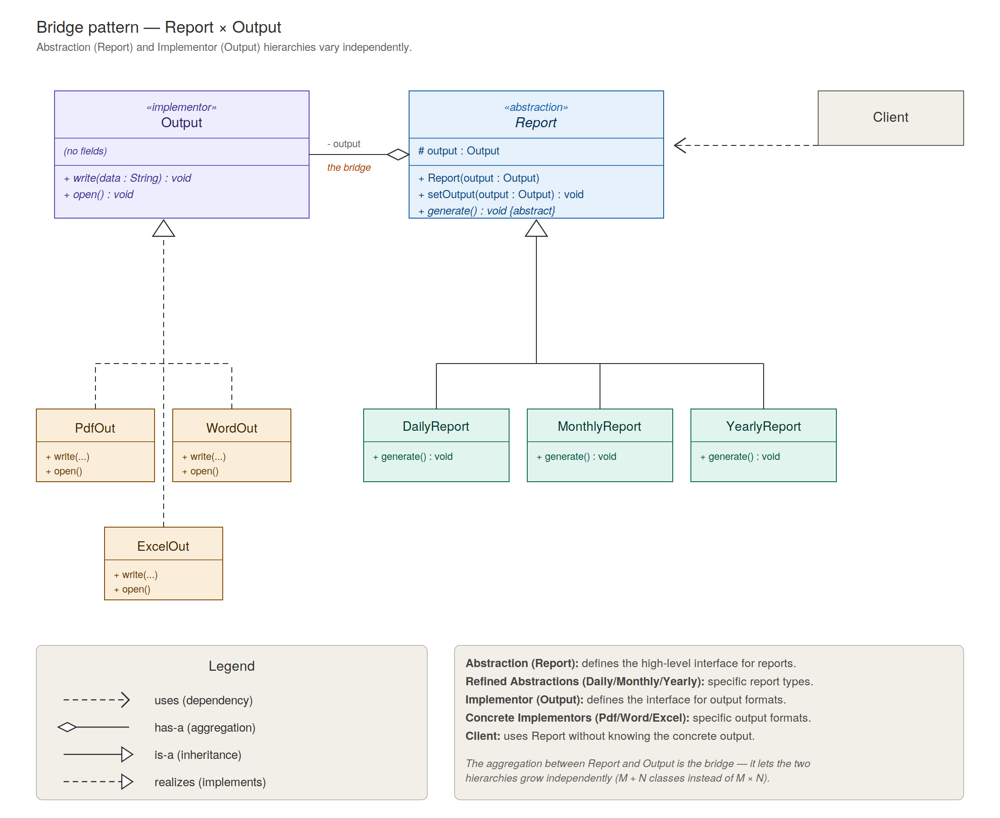
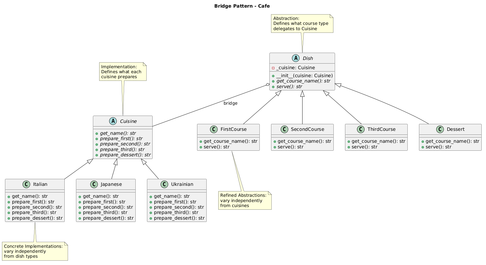

# Bridge Pattern

An implementation of the Bridge design pattern that decouples dish course types (abstraction) from cuisine implementations, allowing both to vary independently.


## Problem and Solution

### The Problem
When a class has two independent dimensions of variation, inheritance alone leads to a combinatorial explosion:

- **Class Explosion**: Supporting 4 courses × 3 cuisines without Bridge requires 12 concrete classes: `ItalianFirstCourse`, `JapaneseFirstCourse`, `UkrainianFirstCourse`, `ItalianSecondCourse`...
- **Rigid Coupling**: Each subclass is locked to both a course type and a cuisine — adding a new cuisine means adding 4 new classes, adding a new course means adding 3 new classes
- **No Runtime Flexibility**: You cannot swap cuisine at runtime without creating a new object of a different class

```python
# Without Bridge — N × M subclasses:
class ItalianFirstCourse: ...
class JapaneseFirstCourse: ...
class UkrainianFirstCourse: ...
class ItalianSecondCourse: ...
# ... 12 classes total, grows as N*M
```

### The Solution
The Bridge pattern splits the two dimensions into separate hierarchies connected by composition:

1. **Abstraction hierarchy** (`Dish`): handles what course type is being served
2. **Implementation hierarchy** (`Cuisine`): handles what each cuisine actually prepares
3. **Bridge**: `Dish` holds a reference to `Cuisine` and delegates preparation to it

```python
# With Bridge — N + M classes:
first_course = FirstCourse(Italian())    # combine freely
first_course = FirstCourse(Japanese())   # swap cuisine, same dish class
second_course = SecondCourse(Italian())  # swap dish, same cuisine
```

## Pattern Overview

The Bridge pattern decouples an abstraction from its implementation so that the two can vary independently.

- **Abstraction** (`Dish`): defines the course interface, holds a reference to `Cuisine`
- **Refined Abstractions** (`FirstCourse`, `SecondCourse`, `ThirdCourse`, `Dessert`): extend `Dish` for each course type
- **Implementation** (`Cuisine`): defines the interface for preparing dishes per cuisine
- **Concrete Implementations** (`Italian`, `Japanese`, `Ukrainian`): implement `Cuisine` for each national cuisine

## Structure

```
structural/bridge/
├── __init__.py              ← Public API
├── __main__.py              ← Demo script
├── cuisine/                 ← Implementation side
│   ├── __init__.py
│   ├── base.py              ← Cuisine (abstract)
│   ├── italian.py           ← Italian
│   ├── japanese.py          ← Japanese
│   └── ukrainian.py         ← Ukrainian
├── dishes/                  ← Abstraction side
│   ├── __init__.py
│   ├── base.py              ← Dish (abstract)
│   ├── first_course.py      ← FirstCourse
│   ├── second_course.py     ← SecondCourse
│   ├── third_course.py      ← ThirdCourse
│   └── dessert.py           ← Dessert
├── bridge_schema.puml       ← Structural class diagram
├── bridge_flow.puml         ← Sequence / call flow diagram
└── tests/
    └── test_bridge.py
```

## Usage

### As a module:
```python
from structural.bridge import FirstCourse, SecondCourse, Italian, Japanese

# Same dish class, different cuisines
print(FirstCourse(Italian()).serve())    # [Italian] Minestrone soup
print(FirstCourse(Japanese()).serve())   # [Japanese] Miso soup

# Same cuisine, different dish classes
italian = Italian()
print(FirstCourse(italian).serve())     # [Italian] Minestrone soup
print(SecondCourse(italian).serve())    # [Italian] Spaghetti Carbonara
```

### Run the demo:
```bash
python -m structural.bridge
```

### Run the tests:
```bash
python -m unittest structural.bridge.tests.test_bridge -v
```

## Key Components

### Abstraction — `Dish` (dishes/base.py)
Holds a `Cuisine` reference and delegates preparation to it:
- `get_course_name() -> str`
- `serve() -> str`

### Refined Abstractions — course classes (dishes/)
Each calls the matching `prepare_*()` method on the cuisine:

| Class          | Delegates to          |
|----------------|-----------------------|
| `FirstCourse`  | `cuisine.prepare_first()`   |
| `SecondCourse` | `cuisine.prepare_second()`  |
| `ThirdCourse`  | `cuisine.prepare_third()`   |
| `Dessert`      | `cuisine.prepare_dessert()` |

### Implementation — `Cuisine` (cuisine/base.py)
Abstract interface for all cuisines:
- `get_name()`, `prepare_first()`, `prepare_second()`, `prepare_third()`, `prepare_dessert()`

### Concrete Implementations — cuisine classes (cuisine/)

| Cuisine     | First          | Second               | Third            | Dessert     |
|-------------|----------------|----------------------|------------------|-------------|
| Italian     | Minestrone soup| Spaghetti Carbonara  | Patate al forno  | Panna Cotta |
| Japanese    | Miso soup      | Salmon Ramen         | Gyoza            | Mochi       |
| Ukrainian   | Borscht        | Chicken Kyiv         | Varenyky         | Syrniki     |

## Benefits

- **No class explosion**: 4 dishes + 3 cuisines = 7 classes instead of 12
- **Independent extension**: Add a new cuisine without touching dish classes, and vice versa
- **Runtime flexibility**: Swap cuisine implementation at any time
- **Single Responsibility**: Course logic and cuisine logic are fully separated

## Diagrams

- **`bridge_schema.puml`** — structural class diagram: Abstraction and Implementation hierarchies
-
- **`bridge_flow.puml`** — sequence diagram: call flow from Client through Dish to Cuisine
