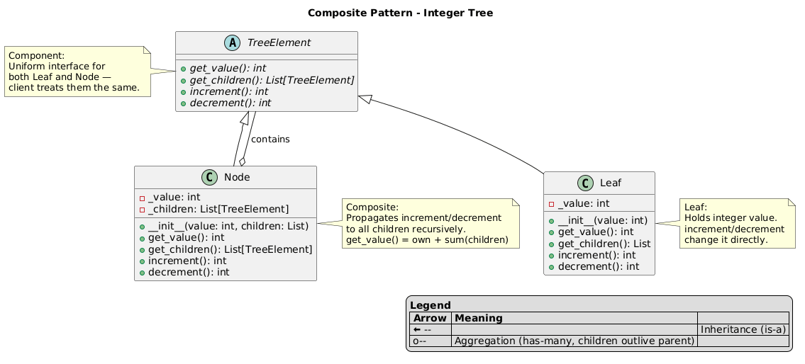

# Composite Pattern

An implementation of the Composite design pattern that builds a tree of integer-valued objects where `increment` and `decrement` propagate recursively to all underlying elements.

## Problem and Solution

### The Problem
When working with tree structures, client code often needs to treat individual elements and groups of elements differently:

- **Inconsistent interface**: Without Composite, you check `isinstance` everywhere to decide whether to recurse into a container or operate on a value directly
- **Tight coupling to structure**: Client must know the tree depth and element types to traverse it correctly
- **Fragile operations**: Propagating an operation (e.g. increment) across the whole tree or a subtree requires manual traversal logic in the client

```python
# Without Composite — client must know the structure:
if isinstance(element, Leaf):
    element.value += 1
elif isinstance(element, Node):
    element.value += 1
    for child in element.children:
        # repeat logic recursively...
```

### The Solution
The Composite pattern gives `Leaf` and `Node` the same interface so the client calls `increment()` on any element — root, subtree, or single leaf — without knowing what it is:

```python
root.increment()    # propagates to every node and leaf in the tree
node_a.increment()  # propagates only to node_a and its subtree
leaf1.increment()   # increments just this leaf
```

## Pattern Overview

- **Component** (`TreeElement`): uniform interface for all elements — `get_value()`, `increment()`, `decrement()`, `get_children()`
- **Leaf** (`Leaf`): holds an integer `_value`, operates on it directly
- **Composite** (`Node`): holds children, propagates operations recursively; `get_value()` returns own value plus sum of all children

## Structure

```
structural/composite/
├── __init__.py              ← Public API
├── __main__.py              ← Demo script
├── tree_element.py          ← TreeElement (ABC)
├── leaf.py                  ← Leaf
├── node.py                  ← Node (Composite)
├── composite_schema.puml    ← Structural class diagram
├── composite_flow.puml      ← Sequence / call flow diagram
└── tests/
    └── test_composite.py
```

## Usage

### As a module:
```python
from structural.composite import Leaf, Node

leaf1, leaf2, leaf3 = Leaf(1), Leaf(2), Leaf(3)
node_a = Node(0, [leaf1, leaf2])
node_b = Node(0, [leaf3])
root   = Node(0, [node_a, node_b])

root.increment()    # all elements +1
node_a.decrement()  # only node_a subtree -1
print(root.get_value())
```

### Run the demo:
```bash
python -m structural.composite
```

### Run the tests:
```bash
python -m unittest structural.composite.tests.test_composite -v
```

## Key Components

### Component — `TreeElement` (tree_element.py)
Abstract interface shared by `Leaf` and `Node`:
- `get_value() -> int`
- `get_children() -> List[TreeElement]`
- `increment() -> int`
- `decrement() -> int`

### Leaf — `Leaf` (leaf.py)
Terminal element. Holds `_value: int` and modifies it directly:
- `get_children()` always returns `[]`
- `increment()` / `decrement()` — `_value += 1` / `_value -= 1`

### Composite — `Node` (node.py)
Branch element. Holds `_value: int` and `_children: List[TreeElement]`:
- `get_value()` — own `_value` + recursive sum of children
- `increment()` / `decrement()` — applies to own value, then propagates to every child

## Example

```
Initial tree:
  Node(0)             ← root
  ├── Node(0)         ← node_a
  │   ├── Leaf(1)
  │   └── Leaf(2)
  └── Node(0)         ← node_b
      └── Leaf(3)

root.get_value()  → 6

root.increment()  → all 6 elements +1 → total 12
node_a.decrement()→ node_a + leaf1 + leaf2 -1 → total 9
```

## Benefits

- **Uniform interface**: client code works identically on a single leaf or an entire subtree
- **Recursive propagation**: no manual tree traversal in client code
- **Targeted operations**: call on any subtree root to limit scope
- **Open/Closed**: add new `TreeElement` subclasses without changing client or existing nodes

## Diagrams

- **`composite_schema.puml`** — structural class diagram: Component, Leaf, Node relationships

- **`composite_flow.puml`** — sequence diagram: propagation of `increment()` and `decrement()` through the tree
