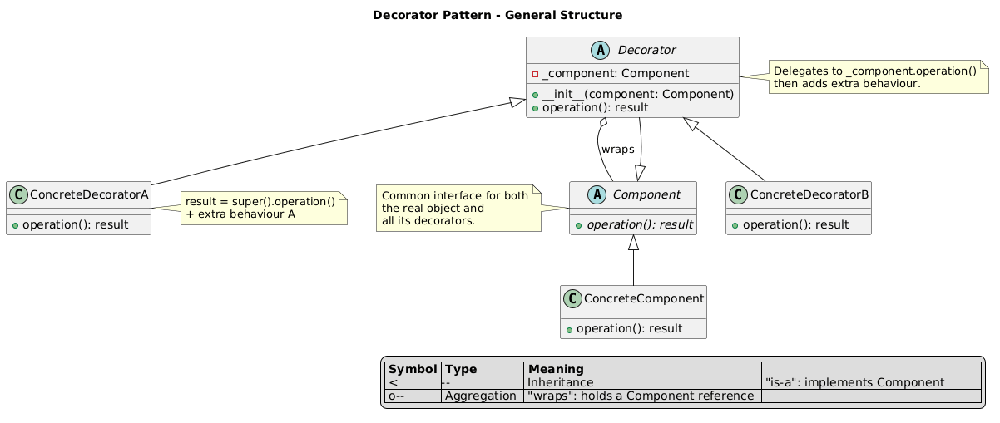

# Decorator Pattern

An implementation of the Decorator design pattern that builds a custom pizza by wrapping a base pizza with topping decorators at runtime.

## Problem and Solution

### The Problem
Supporting every combination of toppings with inheritance causes a class explosion:

- **Subclass explosion**: `CheesePizza`, `BaconPizza`, `CheeseBaconPizza`, `CheeseBaconPineapplePizza`... → 2^N classes for N toppings
- **Rigid at compile time**: you cannot add or combine toppings dynamically
- **Duplicate logic**: every subclass repeats price and description calculation

```python
# Without Decorator — N toppings = 2^N classes:
class CheesePizza(BasePizza): ...
class BaconPizza(BasePizza): ...
class CheeseBaconPizza(BasePizza): ...
# ... grows exponentially
```

### The Solution
The Decorator pattern wraps a `Pizza` object with topping objects that implement the same interface, chaining calls at runtime:

```python
pizza = PizzaBase()
pizza = Cheese(pizza)     # wraps base
pizza = Bacon(pizza)      # wraps cheese+base
pizza = Pineapple(pizza)  # wraps bacon+cheese+base

pizza.get_description()   # "Base Pizza, cheese, bacon, pineapple"
pizza.get_price()         # 9.50
```

## Pattern Overview

- **Component** (`Pizza`): interface with `get_description()` and `get_price()`
- **Concrete Component** (`PizzaBase`): base pizza — starting point for all builds
- **Base Decorator** (`Decorator`): wraps a `Pizza`, implements the interface via Template Method — delegates to `_pizza` and appends topping data from abstract `_get_topping_name()` / `_get_topping_price()`
- **Concrete Decorators** (`Cheese`, `Bacon`, `Pineapple`, `Mushroom`, `Seafood`): each only declares its name and price

## Structure

```
structural/decorator/
├── __init__.py
├── __main__.py              ← demo + interactive user recipe
├── pizza/
│   ├── __init__.py
│   ├── base.py              ← Pizza (ABC)
│   ├── base_pizza.py        ← PizzaBase (concrete component)
│   └── decorator.py        ← Decorator (abstract, Template Method)
├── toppings/
│   ├── __init__.py
│   ├── cheese.py            ← Cheese     (+$1.50)
│   ├── bacon.py             ← Bacon      (+$2.00)
│   ├── pineapple.py         ← Pineapple  (+$1.00)
│   ├── mushroom.py          ← Mushroom   (+$1.50)
│   └── seafood.py           ← Seafood    (+$2.50)
├── uml/decorator_schema.puml    ← Structural class diagram
├── uml/decorator_flow.puml      ← Sequence / call flow diagram
└── tests/
    └── test_decorator.py
```

## Usage

### As a module:
```python
from structural.decorator import PizzaBase, Cheese, Bacon, Seafood

pizza = Seafood(Bacon(Cheese(PizzaBase())))
print(pizza.get_description())  # Base Pizza, cheese, bacon, seafood
print(pizza.get_price())        # 11.0
```

### Run the demo:
```bash
python -m structural.decorator
```

### Run the tests:
```bash
python -m unittest structural.decorator.tests.test_decorator -v
```

## Key Components

### Component — `Pizza` (pizza/base.py)
Abstract interface:
- `get_description() -> str`
- `get_price() -> float`

### Base Decorator — `Decorator` (pizza/decorator.py)
Wraps a `Pizza` and uses Template Method to compose result:
- `_get_topping_name()` — abstract, implemented by each topping
- `_get_topping_price()` — abstract, implemented by each topping
- `get_description()` → `_pizza.get_description() + ", " + _get_topping_name()`
- `get_price()` → `_pizza.get_price() + _get_topping_price()`

### Toppings (toppings/)

| Class      | Name       | Price  |
|------------|------------|--------|
| `Cheese`   | cheese     | +$1.50 |
| `Bacon`    | bacon      | +$2.00 |
| `Pineapple`| pineapple  | +$1.00 |
| `Mushroom` | mushroom   | +$1.50 |
| `Seafood`  | seafood    | +$2.50 |

## Benefits

- **No class explosion**: 5 toppings = 5 decorator classes, not 32 subclasses
- **Runtime composition**: combine any toppings in any order dynamically
- **Single Responsibility**: delegation logic lives once in `Decorator`, toppings are pure data
- **Open/Closed**: add new toppings without modifying existing code

## Diagrams

- **`uml/decorator_schema.puml`** — structural class diagram: Component, Decorator, and topping relationships

- **`uml/decorator_flow.puml`** — sequence diagram: call chain through wrapped decorators
