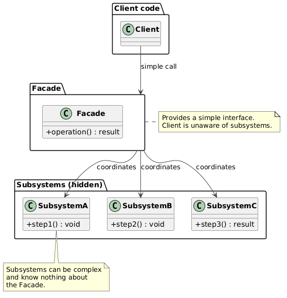
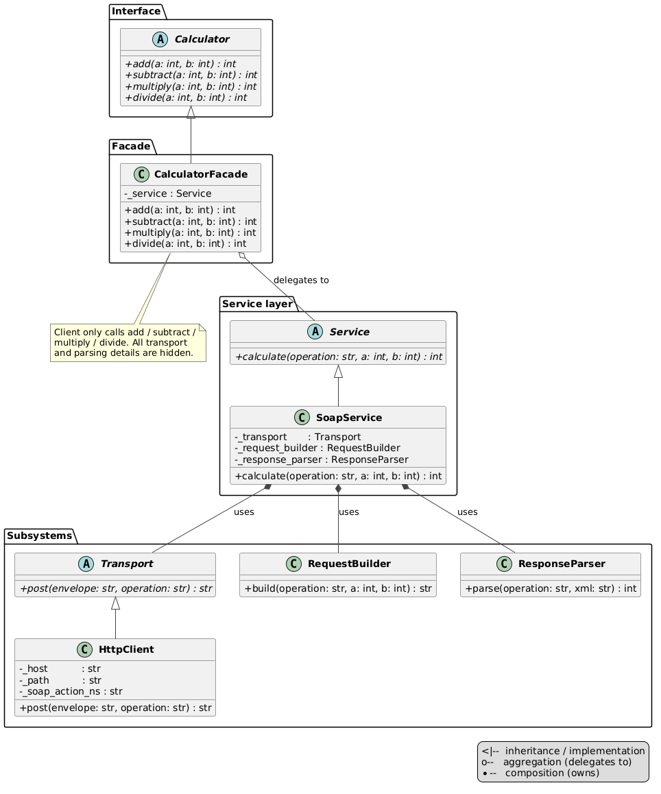

# Facade Pattern

An implementation of the Facade design pattern that hides the complexity of a SOAP web service behind a simple Python interface.

## Problem and Solution

### The Problem
Calling a SOAP web service requires the client to know low-level details: XML envelope format, HTTP headers, namespace URIs, and XML parsing:

```python
# Without Facade — client must know all SOAP details:
ns = "http://tempuri.org/"
envelope = f"""<?xml version="1.0"?>
<soap:Envelope xmlns:soap="http://schemas.xmlsoap.org/soap/envelope/">
  <soap:Body>
    <Add xmlns="{ns}">
      <intA>5</intA><intB>3</intB>
    </Add>
  </soap:Body>
</soap:Envelope>"""
headers = {"Content-Type": "text/xml", "SOAPAction": f'"{ns}Add"'}
conn.request("POST", "/calculator.asmx", body=envelope, headers=headers)
tree = ET.fromstring(conn.getresponse().read())
result = int(tree.find(f".//{{{ns}}}AddResult").text)
```

### The Solution
The Facade wraps all layers and exposes only four clean methods:

```python
# With Facade — client sees only this:
calc = CalculatorFacade(service=SoapService(...))
calc.add(5, 3)        # → 8
calc.subtract(10, 4)  # → 6
calc.multiply(3, 7)   # → 21
calc.divide(20, 4)    # → 5
```

## Pattern Overview

- **Calculator** (`calculator.py`): shared ABC — client depends on this interface only
- **CalculatorFacade** (`calculator_facade.py`): the facade — four simple methods, delegates to `Service`
- **Service / SoapService** (`service/`): orchestrates build → transport → parse pipeline
- **Transport / HttpClient** (`transport/`): sends HTTP POST, returns raw XML
- **RequestBuilder** (`soap/request_builder.py`): builds SOAP XML envelopes
- **ResponseParser** (`soap/response_parser.py`): extracts integer result from XML
- **config.py**: `SERVICE_HOST`, `SERVICE_PATH`, `SOAP_ACTION_NS` — wired in `__main__.py`

## Structure

```
structural/facade/
├── __init__.py
├── __main__.py              ← demo + object wiring
├── calculator.py            ← Calculator ABC (shared interface)
├── calculator_facade.py     ← CalculatorFacade
├── config.py                ← SERVICE_HOST, SERVICE_PATH, SOAP_ACTION_NS
├── service/
│   ├── service.py           ← Service ABC
│   └── soap.py              ← SoapService (build → transport → parse)
├── soap/
│   ├── request_builder.py   ← builds SOAP XML envelope
│   └── response_parser.py   ← parses XML response → int
├── transport/
│   ├── transport.py         ← Transport ABC
│   └── http_client.py       ← HttpClient (HTTP POST via stdlib http.client)
├── uml/
│   ├── facade_general.puml  ← general pattern diagram
│   ├── facade_schema.puml   ← structural class diagram
│   └── facade_flow.puml     ← sequence / call flow diagram
└── tests/
    └── test_facade.py
```

## Usage

### As a module:
```python
from structural.facade import CalculatorFacade
from structural.facade.config import SERVICE_HOST, SERVICE_PATH, SOAP_ACTION_NS
from structural.facade.service import SoapService
from structural.facade.soap import RequestBuilder, ResponseParser
from structural.facade.transport import HttpClient

calc = CalculatorFacade(
    service=SoapService(
        transport=HttpClient(SERVICE_HOST, SERVICE_PATH, SOAP_ACTION_NS),
        request_builder=RequestBuilder(),
        response_parser=ResponseParser(),
    )
)
print(calc.add(5, 3))   # 8
```

### Run the demo:
```bash
python -m structural.facade
```

### Run the tests:
```bash
python -m unittest structural.facade.tests.test_facade -v
```

## Key Components

### CalculatorFacade (`calculator_facade.py`)
Thin facade — receives a `Service` and exposes four named methods.
No SOAP, HTTP, or XML knowledge here.

### SoapService (`service/soap.py`)
Orchestrates the three-step pipeline: build envelope → post → parse result.
Implements `Service` ABC — can be swapped for a mock or different protocol.

### HttpClient (`transport/http_client.py`)
Uses stdlib `http.client` — no third-party dependencies.
Takes `host`, `path`, `soap_action_ns` as constructor args; config imported only at the wiring point.

### config.py
Single place to change the service endpoint:
```python
SERVICE_HOST   = "www.dneonline.com"
SERVICE_PATH   = "/calculator.asmx"
SOAP_ACTION_NS = "http://tempuri.org"
```

## Call Flow

```
Client → CalculatorFacade.add(5, 3)
           → SoapService.calculate("Add", 5, 3)
               → RequestBuilder.build("Add", 5, 3)  → SOAP XML envelope
               → HttpClient.post(envelope, "Add")    → raw XML response
               → ResponseParser.parse("Add", xml)    → 8
           ← 8
```

## Diagrams

- **`uml/facade_general.puml`** — abstract pattern diagram: Client → Facade → Subsystems
- **`uml/facade_schema.puml`** — full structural class diagram with all layers and relationships
-
- **`uml/facade_flow.puml`** — sequence diagram: call flow through all layers for `add(5, 3)`

## Facade vs Adapter

| Aspect | Facade | Adapter |
|--------|--------|---------|
| **Purpose** | Simplify a complex subsystem | Convert one interface into another |
| **Wraps** | Multiple subsystem classes | One existing class |
| **Interface** | Defines a new, simpler interface | Conforms to an existing expected interface |
| **Problem** | Client knows too many details | Class lacks expected interface |

## Benefits

- **Reduced coupling**: client depends only on `Calculator` ABC
- **Replaceable layers**: swap `HttpClient` for a mock `Transport` without touching the facade
- **Config in one place**: `config.py` — one line to change the endpoint
- **Testable**: each layer tested independently; facade tested via mocked `Service`
