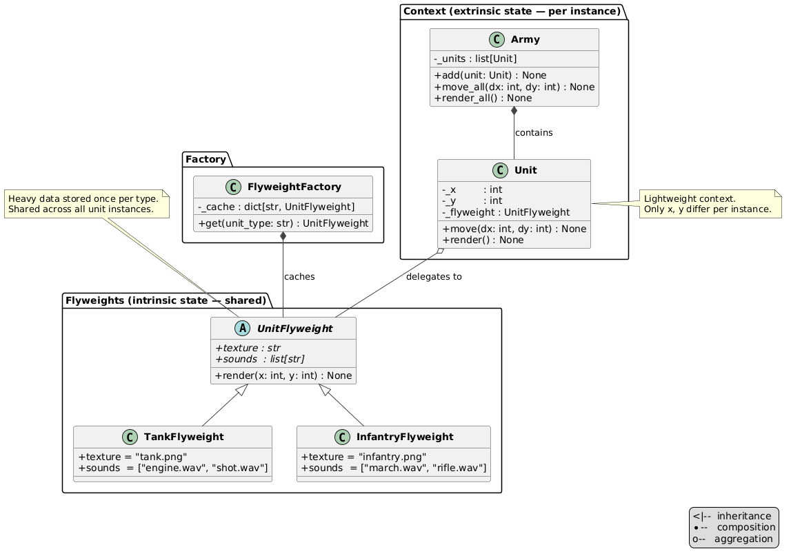

# Flyweight Pattern

An implementation of the Flyweight design pattern for a game unit system where heavy shared data (texture, sounds) is stored only once per unit type, regardless of army size.

## Problem and Solution

### The Problem
A game army can contain thousands of units. Storing a full copy of texture and sound data in every unit instance wastes memory:

```python
# Without Flyweight — every unit holds its own copy of heavy data:
class Tank:
    def __init__(self, x, y):
        self.texture = load_image("tank.png")   # duplicated for every tank
        self.sounds  = load_audio(["engine.wav", "shot.wav"])  # duplicated
        self.x, self.y = x, y

tank1 = Tank(0, 0)
tank2 = Tank(5, 0)   # texture and sounds loaded again
tank3 = Tank(10, 0)  # and again...
```

### The Solution
Split unit state into two parts — shared intrinsic state lives in a flyweight object, unique extrinsic state lives in each unit instance:

```python
factory = FlyweightFactory()

army = Army()
army.add(Unit(x=0,  y=0,  flyweight=factory.get("tank")))
army.add(Unit(x=5,  y=0,  flyweight=factory.get("infantry")))
army.add(Unit(x=10, y=0,  flyweight=factory.get("infantry")))

# Only 2 flyweight objects exist, regardless of army size:
factory.get("tank") is factory.get("tank")          # True
factory.get("infantry") is factory.get("infantry")  # True
```

## Pattern Overview

- **UnitFlyweight** (`flyweights/base.py`): ABC defining intrinsic state interface — `texture`, `sounds`, `render(x, y)`
- **Tank / Infantry** (`flyweights/tank.py`, `flyweights/infantry.py`): concrete flyweights — read-only properties, no mutable state
- **FlyweightFactory** (`factory.py`): cache — creates each flyweight once and returns the same instance on every subsequent call
- **Unit** (`unit.py`): context — holds extrinsic state (`x`, `y`) and a reference to a shared flyweight
- **Army** (`army.py`): collection — uniform interface over heterogeneous units; supports `move_all()` and `render_all()`

## Structure

```
structural/flyweight/
├── __init__.py
├── __main__.py              ← demo
├── module_schema.txt
├── unit.py                  ← Unit (extrinsic: x, y + flyweight ref)
├── factory.py               ← FlyweightFactory (cache)
├── army.py                  ← Army
├── flyweights/
│   ├── __init__.py
│   ├── base.py              ← UnitFlyweight (ABC)
│   ├── tank.py              ← Tank
│   └── infantry.py          ← Infantry
├── uml/
│   ├── flyweight_schema.puml
│   └── flyweight_flow.puml
└── tests/
    └── test_flyweight.py
```

## Usage

### As a module:
```python
from structural.flyweight import Army, FlyweightFactory, Unit

factory = FlyweightFactory()
army = Army()
army.add(Unit(x=0, y=0, flyweight=factory.get("tank")))
army.add(Unit(x=5, y=0, flyweight=factory.get("infantry")))

army.move_all(10, 5)
army.render_all()
```

### Run the demo:
```bash
python -m structural.flyweight
```

### Run the tests:
```bash
python -m unittest structural.flyweight.tests.test_flyweight -v
```

## Key Components

### UnitFlyweight (`flyweights/base.py`)
Abstract base with two abstract properties (`texture`, `sounds`) and a concrete `render(x, y)` method.
The render logic is identical for all types — only the data differs, so it lives in the base class.

### Tank / Infantry (`flyweights/`)
Concrete flyweights. Each only declares its own `texture` and `sounds` as `@property`.
No `__init__`, no mutable state — safe to share across any number of units.

### FlyweightFactory (`factory.py`)
Maintains a `_cache: dict[str, UnitFlyweight]`. On the first call for a given type it
creates and caches the instance; all subsequent calls return the cached object.
`_REGISTRY` maps string keys to classes — adding a new unit type requires one line here only.

### Unit (`unit.py`)
Lightweight context object. Stores only `_x`, `_y`, and a reference to a flyweight.
`move(dx, dy)` updates coordinates; `render()` delegates to the flyweight with current coordinates.

### Army (`army.py`)
Uniform collection of `Unit` objects regardless of their underlying type.
`move_all(dx, dy)` and `render_all()` iterate over all units in one call.

## State Split

| State | Where stored | Examples |
|-------|-------------|---------|
| Intrinsic (shared) | `UnitFlyweight` — once per type | `texture`, `sounds` |
| Extrinsic (unique) | `Unit` — once per instance | `x`, `y` |

## Diagrams

- **`uml/flyweight_schema.puml`** — structural class diagram: flyweights, factory, unit, army and their relationships
-
- **`uml/flyweight_flow.puml`** — sequence diagram: army construction, `move_all()`, and `render_all()` call flow

## Benefits

- **Memory efficiency**: N units of the same type share one flyweight — heavy data allocated once
- **Uniform interface**: `Army` handles tanks and infantry identically through `Unit`
- **Extensible**: add a new unit type by subclassing `UnitFlyweight` and registering it in `FlyweightFactory._REGISTRY`
- **Testable**: flyweight identity (`is`) directly verifiable; coordinates testable without touching shared state
