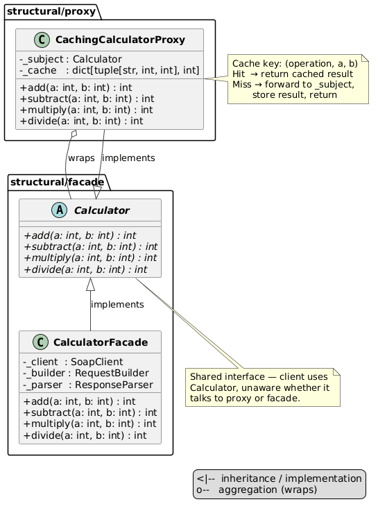

# Proxy Pattern

An implementation of the Proxy design pattern that wraps `CalculatorFacade` with a caching layer — repeated calls with the same arguments are returned from memory without hitting the SOAP service again.

## Problem and Solution

### The Problem
Every call to `CalculatorFacade` makes an HTTP request to a remote SOAP service. Repeating the same calculation pays the network cost every time:

```python
facade = CalculatorFacade()
facade.add(5, 3)   # HTTP → SOAP → parse → 8
facade.add(5, 3)   # HTTP → SOAP → parse → 8  (identical, wasted call)
facade.add(5, 3)   # HTTP → SOAP → parse → 8  (wasted again)
```

### The Solution
A caching proxy sits in front of the facade and intercepts calls. On the first call it forwards to the real facade and stores the result. On any repeated call it returns the cached result immediately:

```python
proxy = CalculatorProxy(CalculatorFacade())
proxy.add(5, 3)   # miss → calls facade → stores result → 8
proxy.add(5, 3)   # hit  → returns from cache → 8  (no network)
proxy.add(5, 3)   # hit  → returns from cache → 8  (no network)
```

## Pattern Overview

- **Calculator** (`structural/facade/calculator.py`): shared ABC — both facade and proxy implement it, so the client needs no changes to swap them
- **CalculatorFacade** (`structural/facade/calculator_facade.py`): real subject — performs actual SOAP calls
- **CalculatorProxy** (`calculator_proxy.py`): caching proxy — checks `_cache` before forwarding; stores results on miss

## Structure

```
structural/
├── facade/
│   ├── calculator.py        ← Calculator ABC (shared interface)
│   └── calculator_facade.py ← real subject, implements Calculator
└── proxy/
    ├── __init__.py
    ├── __main__.py          ← demo
    ├── module_schema.txt
    ├── calculator_proxy.py  ← CachingCalculatorProxy
    ├── uml/
    │   ├── proxy_schema.puml
    │   └── proxy_flow.puml
    └── tests/
        └── test_proxy.py
```

## Usage

### As a module:
```python
from structural.facade import CalculatorFacade
from structural.proxy import CalculatorProxy

proxy = CalculatorProxy(CalculatorFacade())
print(proxy.add(5, 3))        # 8  — forwarded to facade on first call
print(proxy.add(5, 3))        # 8  — returned from cache
print(proxy.multiply(3, 7))   # 21 — forwarded to facade
```

### Run the demo:
```bash
python -m structural.proxy
```

### Run the tests:
```bash
python -m unittest structural.proxy.tests.test_proxy -v
```

## Key Components

### Calculator (`structural/facade/calculator.py`)
Abstract interface with four methods: `add`, `subtract`, `multiply`, `divide`.
Both `CalculatorFacade` and `CalculatorProxy` implement it — the client is decoupled from the implementation.

### CalculatorProxy (`calculator_proxy.py`)
Holds a reference to any `Calculator` as `_subject` and a `_cache: dict[tuple[str, int, int], int]`.

Cache key is a tuple `(operation, a, b)` — structurally distinct, no encoding ambiguity:
```python
("add", 1, 23) != ("add", 12, 3)   # always correct
```

`_call()` centralises the cache logic used by all four methods:
```python
def _call(self, operation: str, a: int, b: int) -> int:
    key = (operation, a, b)
    if key not in self._cache:
        self._cache[key] = getattr(self._subject, operation)(a, b)
    return self._cache[key]
```

## Cache Behaviour

| Scenario | Result |
|----------|--------|
| First call with given `(op, a, b)` | Forwarded to facade, result stored |
| Repeated call with same `(op, a, b)` | Returned from cache, facade not called |
| Same arguments, different operation | Separate cache entry — not shared |
| Proxy wrapping another proxy | Works — proxy accepts any `Calculator` |

## Diagrams

- **`uml/proxy_schema.puml`** — structural class diagram: `Calculator` interface, facade, proxy and their relationships

- **`uml/proxy_flow.puml`** — sequence diagram: cache miss, cache hit, and different-argument scenarios

## Benefits

- **Transparent**: client code uses `Calculator` — swapping facade for proxy requires one line change
- **Zero network cost on repeated calls**: identical requests never reach the SOAP service
- **Composable**: proxy wraps any `Calculator`, including another proxy
- **No cache invalidation needed**: calculator results are deterministic — `add(5, 3)` is always 8
